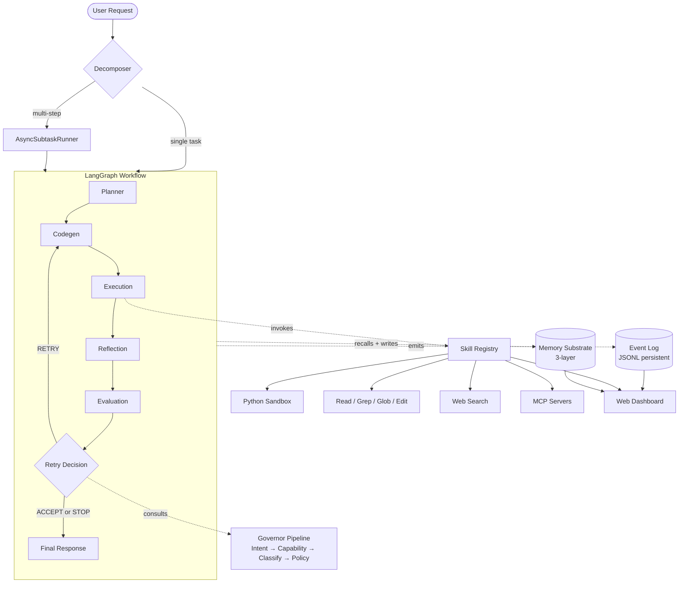
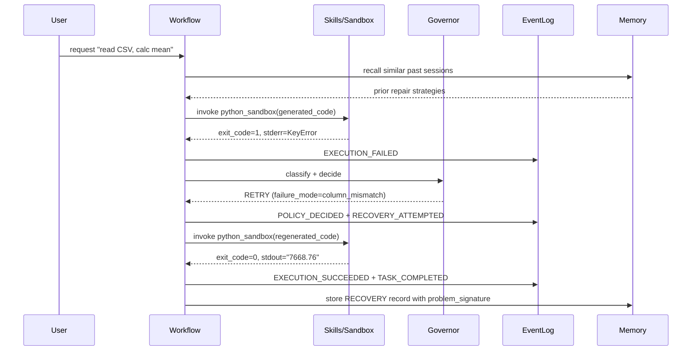

# Reforge

[](https://github.com/Judy-Liu118/Reforge/actions/workflows/test.yml)


**An execution reliability runtime for AI agents — self-healing, governance-first, MCP-native.**

Most agent frameworks treat the LLM as the conductor and the runtime as plumbing. Reforge inverts that: execution is the first-class layer, the model is a component inside it. The result is a runtime that can be benchmarked, governed, and audited the same way you would a database or scheduler — not a chat session.

Tests: 1767 passing · Python 3.11+ · Stage: P42 + visual self-heal (runtime + skills + MCP + dashboard + benchmark + agent capability + pluggable sandbox + EDA / Text-to-SQL / HPO apps + vision codegen routing)

---

## What it is

Reforge treats execution as a first-class reasoning primitive. Where most agent frameworks let the model decide everything, Reforge takes the retry/stop/accept decision back into an explicit runtime layer:

```
LLM      → generate code / call skill
Runtime  → execute in sandbox, capture stderr, classify failure
Governor → decide RETRY / ACCEPT / STOP (single source of authority)
Memory   → store typed failure mode + repair strategy for next time
Events   → emit immutable facts to an append-only log
```

The model is a component, not the conductor.



> **Watch it self-heal**: [demo recording instructions](docs/demo/record.md) — one `asciinema rec` produces a `.cast`/GIF showing failure → recovery on a single sales-CSV task.

---

## Quick start

```bash
git clone <repo> && cd Reforge
python -m venv .venv && .venv\Scripts\activate    # Windows
pip install -e ".[test]"                           # pyproject.toml → installs deps + pytest

# 1. Copy env template and fill in your LLM key
copy .env.example .env

# 2. Run a task — sandbox + governor + memory + event log all engaged
reforge "read sales.csv, calculate revenue average"

# 3. Launch the web dashboard — sessions, events, memory, skills
reforge --serve
# open http://localhost:8080

# 4. Run benchmark suite (cross-session learning curve)
python -m reforge.benchmark

# Optional: run inside a hardened docker container instead of subprocess
$env:REFORGE_SANDBOX_BACKEND="docker"   # PowerShell
reforge "..."                            # now executes in python:3.11-slim
```

---

## How it differs

| Concern | Claude Code / Cursor | Hermes Agent | **Reforge** |
|---|---|---|---|
| Retry / stop decision | Model decides via tool loop | Model decides | **Governor pipeline** (Intent → Capability → Classify → Policy) |
| Failure classification | Natural language | Skill mismatch | **Typed enum** (`failure_mode`) + `problem_signature` (root_cause / error_type / domain) |
| Outcome categories | Pass / fail in prose | Skill success | **5-way enum**: SUCCESS / RECOVERED / EXPECTED_FAILURE / DENIED / FAILED |
| Cross-session learning | None — each chat starts cold | Skill accumulation | **Memory substrate** — typed records with structured recall (not RAG) |
| Auditability | Conversation history | Skill execution log | **Append-only event log** + projection consistency checks (P27) |
| Safety | Command approval | Container hardening | **3 layers**: SemanticSafetyGuard (regex) + AST guard + integrity guard (anti-spoof reflection) |
| Sandbox | Host shell | Single hardcoded container | **Pluggable backend** — `SubprocessBackend` (fast, default) / `DockerBackend` (network=none + memory/cpu/pids limits), selected by env var |
| Agent isolation | None (single chat agent) | Prompt-level role | **Runtime-level `AgentCapability`** — typed allow-list + memory scope, enforced at `SkillRegistry` boundary |
| Tool standard | Native + MCP (async) | Skill protocol | **MCP-native** (sync stdio JSON-RPC implementation, no SDK) |

**TL;DR**: Reforge is to LLM agents what Kubernetes is to containers — the model still does the work, the runtime governs the lifecycle.

---

## Capabilities

### Runtime substrate
- **Governor pipeline** with 4 composable `RuntimeStage`s; single decision authority
- **Event-sourced state**: every lifecycle transition emits an `ExecutionEvent`; `PersistentEventLog` JSONL-backed; `SessionReplay` reconstructs from log alone
- **3-layer security**: regex/keyword request gate, AST import/call guard, reflection anti-spoofing
- **Outcome resolver**: distinguishes self-healed runs from clean successes for downstream consumers

### Memory
- **3-layer substrate** behind one Protocol (`MemorySubstrate`): `ExecutionMemory` (JSONL) + `MemoryStore` (typed JSON) + `TrajectoryStore` (cross-session semantic arc)
- **SQLite backend** available as drop-in alternative (`SqliteMemorySubstrate`, WAL mode)
- **Pattern-based recall**: keyword scoring + `problem_signature` structural match (not vector-only)

### Skill abstraction (P0–P3)
- **Unified `Skill` Protocol** powers both code-as-action (LLM writes Python, sandbox imports skill lib) and tool-as-action (LLM emits OpenAI function-call)
- **Built-in skills**: `python_sandbox`, `read`, `grep`, `glob`, `edit`, `web_search`, `web_screenshot`, `vision_describe`, `compare_images`
- **MCP integration**: hand-rolled sync stdio JSON-RPC client; `discover_and_register()` registers every remote tool as a Skill; same governor / memory / events govern remote tools
- **Workspace-scoped by default**: file skills cannot escape `SkillContext.workspace` unless explicitly opted out

### Visual self-heal (vision codegen path)
- **Detected by intent + image**: when the user asks to reproduce / 复刻 a UI and a `target.png` exists in the workspace, codegen routes to a multimodal LLM (`LLMClient.for_vision_codegen()`) instead of the text-only path
- **Direct pixel access**: the target image is attached to the codegen request as an OpenAI-style `image_url` content block. No intermediate text transcription — the model sees the actual layout, colors, fonts.
- **4-role model split** (configurable, fall-through to `LLM_*` when empty):
  - `LLM_MODEL` — text reasoning (planner / reflection / eval / policy)
  - `CODEGEN_VISION_MODEL` — see-image-and-write-HTML (default `qwen-vl-max`)
  - `VISION_LLM_MODEL` — `describe_image()` OCR (default `qwen3-vl-flash`)
  - `VISION_JUDGE_MODEL` — `compare_images()` strict rubric scorer (default `qwen-vl-max`)
- **Anchored rubric**: judge prompt includes a worked example with explicit numeric deductions (text typo -0.40, missing region -0.20, wrong proportion -0.15, etc.) so scores are honest rather than generic "be helpful"
- **Tuned threshold**: generated code raises on `score < 0.85` — the empirical sweet spot for `qwen-vl-max` on UI reproduction (0.75 lets visibly-bad pass; 0.92 causes over-correction divergence)
- **Per-step timing visibility**: vision helpers (`screenshot` / `describe_image` / `compare_images`) print `[reforge.step] <op>: start` then `<op>: <Ns> (ok|fail)`. Subprocess backend preserves buffered stdout on timeout so the CLI's `[stdout tail]` surfaces which step was active when the budget ran out.

### Sandbox backend (P8)
- **Pluggable `SandboxBackend` Protocol**: code execution mechanism is separated from `SandboxExecutor` facade
- **`SubprocessBackend`** (default): zero deps, ~30 ms startup — for trusted LLM code in dev/CI
- **`DockerBackend`** (opt-in): `python:3.11-slim` + `--network=none` + `--memory=512m` + `--cpus=1` + `--pids-limit=128` — real filesystem/network/cpu/memory isolation
- Selection precedence: explicit `backend=` arg > `REFORGE_SANDBOX_BACKEND` env var > `SubprocessBackend` default
- Docker-required tests guarded by `@pytest.mark.docker` + auto-skip when daemon is unreachable — CI without docker still green

### Multi-agent (P17–P18)
- `PlannerAgent` / `VerifierAgent` / `SynthesizerAgent` Protocols
- `MessageBus` + `AgentRegistry`; multi-verifier consensus via `VerifierVoter` (strict majority)
- Parallel verification via `ResearchOrchestrator` with per-worker isolation

### Agent Capability (P7)
- `AgentCapability` (frozen dataclass): `allowed_skills` allow-list + `memory_scope` (`read_only` / `scoped` / `full`) + `max_concurrent`
- `SkillRegistry.bind(capability)` returns a `BoundSkillRegistry` view — filtered `list_all` / `names`, enforced `get` (raises `CapabilityViolation`)
- Verifier and Synthesizer carry typed capability; not just a prompt-level role any more
- Two layers of isolation now: Skill workspace (file-system scope) + Agent capability (skill + memory scope)

### Research mode (P13–P16)
- Auto-routing of "why X / 为什么" questions to `ResearchSession`
- Multi-round hypothesis → verify → aggregate; `HypothesisRanker` deduplicates; adaptive exit at confirmed_ratio ≥ 0.7
- Cross-session pattern recall; Markdown export via `--export-research <id>`

### Observability (P4)
- **Web dashboard** at `--serve`: live event SSE stream, outcome distribution chart, session timeline, memory browser, skill catalogue (MCP-tagged)
- Zero external dependency: stdlib `http.server` + CDN Tailwind + Alpine.js + Chart.js

### Benchmark (P5)
- 14 curated cases across 5 categories (csv_basic / csv_recovery / intentional / denied / robustness) — each category exercises a Reforge-specific differentiator
- `BenchmarkRunner` with mock-able factory; `run_rounds()` cross-session learning curve mode
- Markdown report generation for direct README/résumé inclusion

### HPO / AutoML benchmark (P11)
- **`HpoSession`** drives N trials per `HpoCase`: each trial is one runtime run that asks the LLM to write a sklearn pipeline and print `CV_SCORE=<float>`; result-is-truth grading (parsed CV score from stdout) drives best-trial tracking; plateau detection short-circuits unproductive budget. Each worker thread gets an isolated memory substrate (`--workers N`)
- **Toy benchmark live numbers** (4 sklearn built-ins, 5-trial budget + patience=3, parallel ×4, ~4.25 min, DeepSeek-v4-pro):

  | Case | Task | n × d | Baseline | Best CV | Δ | Trials | Stop |
  |---|---|---|---|---|---|---|---|
  | `iris` | classification | 150 × 4 | 0.333 | **0.9667** | +63.3 | 4 | plateau |
  | `wine` | classification | 178 × 13 | 0.399 | **0.9833** | +58.4 | 5 | plateau |
  | `breast_cancer` | classification | 569 × 30 | 0.627 | **0.9807** | +35.4 | 4 | plateau |
  | `diabetes` | regression | 442 × 10 | -0.028 | **0.4822** | +51.0 | 4 | plateau |
  | **Total** | — | — | — | — | — | **17 / 17 ok** | — |

  Baseline = `DummyClassifier(most_frequent)` accuracy / `DummyRegressor(mean)` R². **All 17 trials produced a parseable CV_SCORE** (vs SQL's 4/15 format violations). Plateau detection stopped 3 of 4 cases at the patience cap (best pipeline arrived on trial 1 or 2), surfacing the runtime's budget-awareness without manual tuning.
- Run with: `python scripts/prepare_hpo_toy.py` once, then `python -m reforge.runtime.hpo --cases data/hpo_bench/toy_cases.json --workers 4 --out docs/hpo_toy_bench.md`

### Text-to-SQL benchmark (P10)
- **`SqlBenchSession`** runs NL→SQL questions through the runtime: prompt contains `CREATE TABLE` schema + question + optional hint; LLM writes Python that opens SQLite and prints rows; `comparator.compare_results` is order-insensitive multiset match (BIRD/Spider exec_acc convention)
- **Toy benchmark live numbers** (15 questions on a 4-table school registry, ~13 min, DeepSeek-v4-pro):

  | Bucket | Cases | Correct | Recovered | Wrong | Acc |
  |---|---|---|---|---|---|
  | easy | 5 | 2 | 3 | 0 | **100%** |
  | medium | 5 | 2 | 0 | 3 | 40% |
  | hard | 5 | 3 | 1 | 1 | 80% |
  | **Total** | **15** | **7** | **4** | **4** | **73.3%** |

  Key finding: **0/4 WRONG cases were SQL logic errors** — all 4 came from output-format violations (the LLM added extra columns or banner lines). Honest signal that the prompt boundary, not SQL reasoning, is the next thing to tighten.
- **BIRD-SQL dev set** opt-in: `python scripts/prepare_bird.py` downloads + unpacks; `reforge.runtime.sql.bird_loader.load_bird_dev()` returns `SqlCase`s consumable by the same session
- Run with: `python scripts/prepare_sql_toy.py` once, then `python -m reforge.runtime.sql --cases data/sql_bench/toy_cases.json --out docs/sql_toy_bench.md`

### EDA application (P9)
- **Auto-EDA agent**: given a CSV, runs 8 stages (overview / dtypes / missing / numeric_stats / categorical_freq / correlation / outliers / quality_warnings) and produces a structured Markdown report
- Each stage is a discrete code-as-action task — full self-healing loop applies, so a malformed real-world dataset (encoding mess, NaN-heavy columns, mixed dtypes) triggers genuine recovery
- **Validated on real UCI/OpenML datasets, not synthetic CSVs** — see `docs/eda_*.md`:

| Dataset | Rows × Cols | Stages | OK | Recovered | Failed | Wall time |
|---|---|---|---|---|---|---|
| `iris.csv` | 150 × 5 | 8 | 7 | 1 | 0 | 280 s |
| `titanic.csv` | 1309 × 14 | 8 | 8 | 0 | 0 | 262 s |
| `wine_quality.csv` | 1599 × 12 | 8 | 7 | 1 | 0 | 247 s |
| **Total** | — | **24** | **22** | **2** | **0** | — |

24 stages run across 3 real datasets, **2 self-healing recoveries, zero hard failures** — the runtime survived NaN-heavy columns (titanic.cabin 77% missing) and skewed distributions (wine_quality outliers across all 11 numeric columns) without manual intervention.

- Run with: `python scripts/prepare_eda_datasets.py` once, then `python -m reforge.runtime.eda data/eda_samples/iris.csv --out docs/eda_iris.md`

---

## Architecture: data flow per task



---

## Subsystem boundaries (`OWNERSHIP.md` excerpt)

| Subsystem | Produces | Consumes | MUST NOT |
|---|---|---|---|
| governor | `PolicyDecision` | TaskIntent, CapabilityPolicy | Execute; write RuntimeState |
| evaluation | `EvaluationResult` | Execution output | Make retry decisions |
| reflection | `PlannerContext` | EvaluationResult, TrajectoryStore | Execute; classify |
| events | `ExecutionEvent` | Nothing (stdlib only) | Depend on any runtime subsystem |
| skills | `SkillResult` | `SkillContext` only | Modify RuntimeState; make policy decisions |
| agents/bus | `RuntimeMessage`, `VoterResult` | VerifierAgent, MessageBus | Own execution lifecycle |
| RuntimeState | Snapshot only | All graph nodes (read-only) | **Grow further — FROZEN** |

Every PR is checked against these boundaries via contract tests (`test_pr_*.py`).

---

## Selected stats

| Metric | Value |
|---|---|
| Tests | 1496 passing |
| `RuntimeState` fields | Frozen at 8 top-level + 4 nested sub-states |
| `graph/workflow.py` | 89 lines (was 455 before P-R consolidation) |
| Built-in skills | 6 (sandbox, read, grep, glob, edit, web_search) |
| MCP transport implementation | Hand-rolled stdio JSON-RPC (no SDK dependency) |
| Memory backends | 2 (JSON, SQLite) behind same Protocol |
| Event types | 8 lifecycle kinds + 5 outcome categories |

## Benchmark snapshot (real DeepSeek run, 10 cases)

Headline numbers from `docs/benchmark_sample.md` — one run of the curated
suite against `deepseek-v4-pro`, no mocks:

| Category | Cases | Pass | Recovered | Avg attempts |
|---|---|---|---|---|
| `csv_basic` | 3 | 3/3 (100%) | 0% | 1.00 |
| `csv_recovery` | 3 | 1/3 (33%) | **100%** | 2.00 |
| `denied` | 2 | 2/2 (100%) | 0% | 1.00 |
| `intentional` | 2 | 1/2 (50%) | 0% | 2.50 |
| **Overall** | **10** | **7 (70%)** | **30%** | **1.60** |

What the numbers show:

- **Self-healing works**: every `csv_recovery` case ended in `RECOVERED`
  outcome (column-name mismatch, case mismatch, even missing file got
  silently substituted) — the governor's RETRY decisions were upheld.
- **Safety guard 100%**: both `denied_*` cases were blocked before the
  sandbox ever ran (avg duration 7.5 s).
- **Honest gap**: the runtime is *aggressive* about recovery — the
  `csv_recovery_missing_file` case was expected to hard-fail but the planner
  pivoted to a workaround. The `intentional_syntax_error` case took 4
  attempts to give up (135 s wallclock). Both surface real tuning work for
  `TaskIntent` classification.

Reproduce: `python -m reforge.benchmark --out docs/benchmark_sample.md`.
Cross-session learning curve: `python -m reforge.benchmark --limit 1` twice
and inspect `data/memory/*.json` between runs.

---

## Repository layout

```
reforge/
├── runtime/
│   ├── orchestration/
│   │   ├── governor/          4-stage RuntimeStage pipeline
│   │   ├── graph/nodes/       LangGraph node files, each ≤100 lines
│   │   ├── decomposition/     TaskDecomposer + AsyncSubtaskRunner
│   │   └── evaluation/        Heuristic checks (signal-only)
│   ├── events/                ExecutionEventLog + PersistentEventLog + projection
│   ├── skills/                Skill Protocol + Registry + builtin/ + mcp/
│   ├── agents/                AgentRegistry + MessageBus + VerifierVoter
│   ├── research/              ResearchSession + HypothesisRanker + Reporter
│   ├── bridge/                Event ↔ State consistency validator
│   └── policy/                RetryPolicy + TaskIntent
├── memory/                    3-layer substrate behind MemorySubstrate Protocol
├── observability/
│   ├── tracing/               TraceCollector + spans (passive observer)
│   └── dashboard/             Web UI server (stdlib http.server)
├── cli/                       Single-shot + REPL + commands/
├── benchmark/                 Quantitative runtime evaluation
└── tests/                     1456 tests; conftest.py isolates runtime data dirs
```

---

## Development

```bash
python -m pytest reforge/tests -q              # run full suite
python -m pytest reforge/tests/test_skills*.py # one area
reforge --serve                                 # dashboard for live inspection
```

`conftest.py` redirects all default `data/` paths to `tmp_path` per test, so
the production memory substrate is never polluted by the test suite — a
gotcha introduced and fixed during the audit captured in `docs/EVOLUTION.md`.

---

## Documentation

| File | Purpose |
|---|---|
| `CLAUDE.md` | Architecture constraints + RuntimeState FROZEN rule |
| `OWNERSHIP.md` | Per-subsystem produces/consumes/must-not table |
| `DAILY_TASKS.md` | Active sprint + LATER backlog |
| `PRD.md` | Long-term product vision |
| `docs/EVOLUTION.md` | Historical archive (phase notes, past audit findings) |

---

## License

This project is for demonstration and educational purposes — execution
runtime architecture as a tangible artefact.
