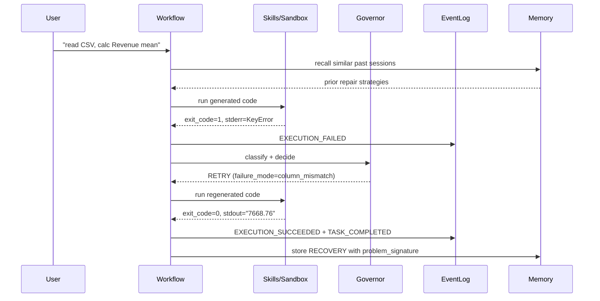

# Reforge

[](https://github.com/Judy-Liu118/Reforge/actions/workflows/test.yml)


**An execution-reliability runtime for AI agents.** The retry / stop / accept
decision is taken out of the model and into an explicit, typed, auditable
runtime layer — so an agent's execution lifecycle can be governed, replayed,
and benchmarked like infrastructure, not a chat session.

---

## The idea in one diagram

Most agent stacks let the LLM decide everything inside a tool loop. Reforge
inverts that: execution is the first-class layer, the model is one component
inside it.

```
LLM      → generate code / call skill
Runtime  → execute in sandbox, capture stderr, classify failure
Governor → decide RETRY / ACCEPT / STOP   (single source of authority)
Memory   → store typed failure mode + repair strategy for next time
Events   → emit immutable facts to an append-only log
```

The consequence: when a task fails in a recoverable way, the runtime — not the
model's free-form judgement — decides whether to retry with a targeted fix,
stop with a typed reason, or accept. Every decision is an event on an
append-only log, so any run can be replayed and audited after the fact.

---

## See it work: self-heal on a failing task



The honest comparison is an **ablation, not a product race**: same model, same
task, governor + memory **off** vs **on**. With the runtime layer off, a naive
retry loop either burns its budget, gives up, or returns a confidently wrong
answer with no audit trail. With it on, the failure is classified, the retry is
targeted, and the whole run is replayable from the event log.

The toggle is a real env flag, not a slogan:

```bash
# On  — typed governor pipeline (Intent → Capability → Classify → Policy)
reforge "read sales.csv, calc revenue mean"

# Off — naive while-retry baseline (exit_code != 0 → RETRY, else ACCEPT)
$env:REFORGE_GOVERNOR_BYPASS="1"; reforge "read sales.csv, calc revenue mean"
```

Same model, same task, same sandbox — only the decision layer changes. See
`reforge/tests/test_governor_bypass.py` for the behavioural contract.

> Demo recording: [`docs/demo/record.md`](docs/demo/record.md) — one
> `asciinema rec` produces a cast/GIF of failure → recovery on a single task.

---

## How it differs (conceptual)

This is an architectural contrast, **not** a benchmark claim against these
products.

| Concern | LLM-as-conductor agents | **Reforge** |
|---|---|---|
| Retry / stop decision | Model decides inside the tool loop | **Governor pipeline** (Intent → Capability → Classify → Policy), single authority |
| Failure classification | Natural language | **Typed enum** `failure_mode` + structured `problem_signature` |
| Cross-session learning | Each run starts cold | **Memory substrate** — typed records, structural recall (not vector-only) |
| Auditability | Conversation history | **Append-only event log** + `SessionReplay` reconstruction |
| Safety | Command approval | **3 layers**: request gate (regex) + AST guard + reflection anti-spoofing |
| Sandbox | Host shell / one container | **Pluggable backend** — subprocess (default) or hardened Docker |

---

## Benchmark snapshot

One run of the curated 10-case suite against `deepseek-v4-pro`, no mocks
(`docs/benchmark_sample.md`). Reported as-is, including the cases where actual
≠ expected — those are real tuning signals, not failures to hide.

| Category | Cases | Pass | Recovered | Avg attempts |
|---|---|---|---|---|
| `csv_basic` | 3 | 3/3 (100%) | 0% | 1.00 |
| `csv_recovery` | 3 | 1/3 (33%) | **100%** | 2.00 |
| `denied` | 2 | 2/2 (100%) | 0% | 1.00 |
| `intentional` | 2 | 1/2 (50%) | 0% | 2.50 |
| **Overall** | **10** | **7 (70%)** | **30%** | **1.60** |

- **Self-healing holds**: every `csv_recovery` case ended `RECOVERED` — the
  governor's RETRY decisions were upheld and produced correct output.
- **Safety guard 100%**: both `denied_*` cases (incl. `rm -rf`, fork bomb, and
  a prompt-injection variant) were blocked before the sandbox ever ran.
- **Honest gap**: `csv_recovery_missing_file` was *expected* to hard-fail but
  the runtime recovered too aggressively — a real `TaskIntent` tuning target,
  left visible on purpose. The fixture itself is also weak (see
  `docs/experience_benchmark.md` §8.5) and will be reworked in v3.

Reproduce: `python -m reforge.benchmark --out docs/benchmark_sample.md`

### Memory ablation (paired, multi-seed)

The benchmark above is descriptive. For a controlled signal-vs-noise read on
whether **cross-session memory actually helps**, the Experience Memory
Benchmark runs the same fingerprint axis twice per pair (Cold = fresh
substrate per case, Warm = pre-seeded substrate from a sibling case) across 5
seeds with 95% CI:

| KPI (warm − cold, per-seed delta) | Mean | 95% CI | Verdict |
|---|---|---|---|
| Transfer success rate | +0% | [+0%, +0%] | consistent with noise |
| First-try rate delta | +4% | [-7%, +15%] | consistent with noise |
| Attempts reduction | +0.04 | [-0.07, +0.15] | consistent with noise |

The **honest** finding (4/5 pairs deterministic; P2 carries all the variance;
P3/P4 fixtures are too easy for the LLM to one-shot): on this suite, this
memory layer does **not** reach statistical significance. This is what a
publishable null result looks like — methodology hardened from v0's
contaminated +20% to v1's isolated +0% to v2's multi-seed CI. See
[`docs/experience_benchmark.md`](docs/experience_benchmark.md) for the full
v0 → v1 → v2 progression and the v3 roadmap (fix weak fixtures, add Memory
Influence Score to disambiguate recall vs used).

---

## Quick start

```bash
git clone https://github.com/Judy-Liu118/Reforge.git && cd Reforge
python -m venv .venv && .venv\Scripts\activate     # Windows
pip install -e ".[test]"

cp .env.example .env        # fill in your LLM key

# Run a task — sandbox + governor + memory + event log all engaged
reforge "read sales.csv, calculate revenue average"

# Web dashboard — live events, sessions, memory, skills
reforge --serve             # http://localhost:8080

# Hardened sandbox (opt-in): python:3.11-slim, --network=none, mem/cpu/pids limits
$env:REFORGE_SANDBOX_BACKEND="docker"   # PowerShell
reforge "..."
```

---

## Applications

The runtime is exercised on real tasks (not synthetic CSVs) to show the
self-heal loop survives messy real-world data. Each has a reproducible report
under `docs/`:

- **Auto-EDA** — 8-stage profiling of a CSV; validated on UCI/OpenML `iris` /
  `titanic` / `wine_quality` (24 stages, 2 recoveries, 0 hard failures). See `docs/eda_*.md`.
- **Text-to-SQL** — NL→SQL through the runtime, order-insensitive exec-match
  grading (BIRD/Spider convention). See `docs/sql_toy_bench.md`.
- **HPO** — drives N sklearn-pipeline trials per case with result-is-truth
  grading + plateau detection. See `docs/hpo_toy_bench.md`.

---

## Architecture

`RuntimeState` is **frozen** — no new top-level fields; new state flows through
`ExecutionEvent` to the append-only log. Four runtime layers each own a
sub-state and a hard responsibility boundary:

| Layer | Writes | Owns |
|---|---|---|
| Sandbox executor | `exec_state` | stdout / stderr / exit_code |
| Governor | `control_state` | retry decision (single authority) |
| Reflection + Eval | `semantic_state` | intent, reflection, evaluation signals |
| Outcome resolver | `outcome_state` | final outcome + answer |

Subsystem contracts (produces / consumes / must-not) are enforced by contract
tests. Full detail in [`docs/ARCHITECTURE.md`](docs/ARCHITECTURE.md) and
[`OWNERSHIP.md`](OWNERSHIP.md).

```
reforge/
├── runtime/
│   ├── orchestration/   governor pipeline · LangGraph nodes · evaluation
│   ├── events/          event log + persistence + projection
│   ├── skills/          Skill Protocol + builtin/ + MCP client
│   └── policy/          RetryPolicy + TaskIntent
├── memory/              3-layer substrate behind one Protocol (JSON / SQLite)
├── observability/       tracing + stdlib web dashboard
├── cli/                 single-shot + REPL
└── benchmark/           quantitative runtime evaluation
```

---

## Stats

| Metric | Value |
|---|---|
| Tests | **1828 passing** (4 skipped) |
| Largest source file | 476 lines (no god-files) |
| Memory backends | 2 (JSON, SQLite) behind one Protocol |
| MCP transport | hand-rolled stdio JSON-RPC (no SDK) |
| Sandbox backends | 2 (subprocess, Docker) behind one Protocol |

---

## License

MIT — built as a demonstration artefact: agent execution-runtime architecture
you can run, read, and benchmark.
