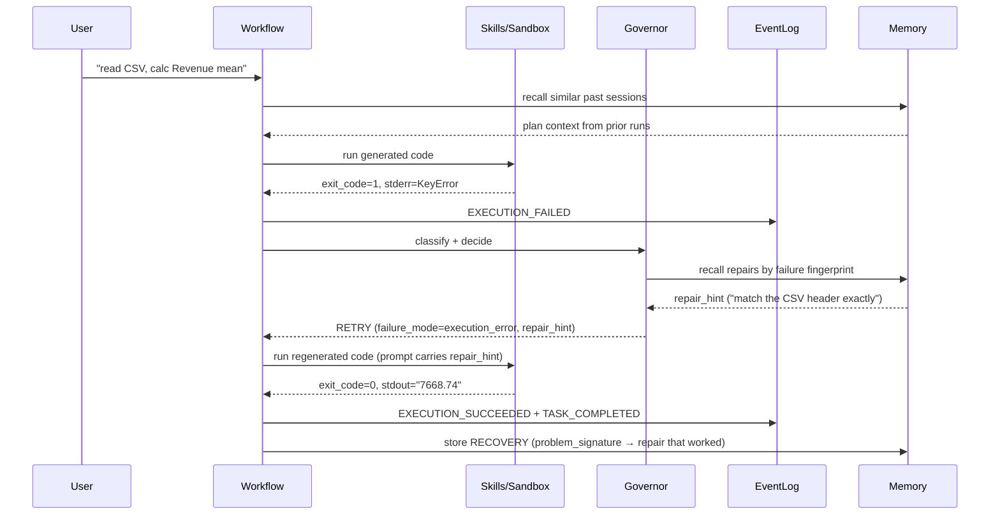

# Reforge

[](https://github.com/Judy-Liu118/Reforge/actions/workflows/test.yml)


**An execution-reliability runtime for AI agents.** The retry decision is
taken out of the model and into an explicit, typed, auditable runtime layer
— so when a task fails in a recoverable way, the runtime classifies the
failure, recalls prior repairs from memory, and retries with a targeted hint
instead of looping blindly.

---

## The idea in one diagram

Most agent stacks let the LLM decide everything inside a tool loop. Reforge
inverts that: execution is the first-class layer, the model is one component
inside it.

```
LLM      → generate code / call skill
Runtime  → execute in sandbox, capture stderr, classify failure
Governor → typed classification → targeted retry on recoverable failure,
           immediate stop on intent-driven or timeout failure
Memory   → store typed failure mode + repair strategy for next time
Events   → emit immutable facts to an append-only log
```

The consequence on recoverable failures: each retry attempt is shaped by a
typed `failure_mode` and a `repair_hint` recalled from memory, rather than a
naive while-retry on `exit_code != 0`. On task-intent-driven failures
(`EXPECTED_ERROR` / `TRACEBACK_DEMO`, classified once from the user's
request by IntentStage — not inferred from runtime execution history) and
watchdog timeouts the governor issues an immediate STOP instead of burning
the budget. Outside those two
paths the governor and a naive baseline retry to the same budget — and
whether that buys better outcomes is a **measured question, not a slogan**:
the pre-registered BIRD ablation below returned an honest null on
success_rate (the mechanism's value concentrates where first attempts fail
*loudly*), and generic unrecoverability recognition remains an open
limitation ([`docs/KNOWN_LIMITATIONS.md`](docs/KNOWN_LIMITATIONS.md) L3).
Every decision lands on an append-only event log, so any run can be replayed
and audited after the fact.

---

## See it work: self-heal on a failing task



The honest comparison is an **ablation, not a product race**: same model, same
task, the governor decision layer and its memory-recalled repair hints **off**
vs **on**. With the runtime layer off, a naive retry loop either burns its
budget, gives up, or returns a confidently wrong answer with no audit trail.
With it on, the failure is classified, the retry prompt carries a repair hint
recalled by failure fingerprint, and the whole run is replayable from the
event log. (Reflection-based root-cause context is part of the base loop and
stays on in both arms — the toggle isolates the decision layer + recall, not
every use of memory.) That is the *mechanism* contrast; what it measurably
buys is reported in [Evaluation methodology](#evaluation-methodology) below,
including where it buys nothing.

The toggle is a real env flag, not a slogan:

```bash
# On  — typed governor pipeline (Intent → Capability → Classify → Policy)
reforge "read sales.csv, calc revenue mean"

# Off — naive while-retry baseline (exit_code != 0 → RETRY, else ACCEPT)
REFORGE_GOVERNOR_BYPASS=1 reforge "read sales.csv, calc revenue mean"
# PowerShell: $env:REFORGE_GOVERNOR_BYPASS="1"; reforge "read sales.csv, calc revenue mean"
```

Same model, same task, same sandbox — only the decision layer changes. See
`reforge/tests/test_governor_bypass.py` for the behavioural contract.

> Demo recording: [`docs/demo/record.md`](docs/demo/record.md) — one
> `asciinema rec` produces a cast/GIF of failure → recovery on a single task.

---

## How it differs (conceptual)

This is an architectural contrast, **not** a benchmark claim against these
products.

| Concern | LLM-as-conductor agents | **Reforge** |
|---|---|---|
| Retry decision | Model decides inside the tool loop | **Governor pipeline** (Intent → Capability → Classify → Policy) — typed classification drives a targeted retry hint, not a free-form judgement |
| Failure classification | Natural language | **Typed enum** `failure_mode` + structured `problem_signature` |
| Cross-session learning | Each run starts cold | **Memory substrate** — typed records, structural recall (not vector-only) |
| Auditability | Conversation history | **Append-only event log** + `SessionReplay` reconstruction |
| Safety | Command approval | **3 layers**: pre-codegen request gate (regex on user_request) + post-codegen AST guard + retry-integrity check (catches blank `except`, swallowed exception, fake success output) |
| Sandbox | Host shell / one container | **Pluggable backend** — subprocess (default) or hardened Docker |

---

## Evaluation methodology

**TL;DR** — two pre-registered runs on a locked BIRD SQL corpus (2 × 200
runs, real LLM, paired per-seed CIs): the governor **does not move
success_rate** (61.0% vs 61.0%, Δ 95% CI [-4.4, +4.4]pp) and costs 1.4×
tokens-per-solved. Along the way, the pre-registered sensitivity appendix
caught the internal evaluator systematically rejecting correct answers
(run 1), the fix was validated on held-out data (FN 42.7% → 0.0%), and a
full re-run confirmed the null is real. Plain reading: retry-with-reflection
pays off where first attempts fail *loudly* (timeouts, tracebacks — see
Phase 0), not where a wrong answer exits cleanly. The deliverable here is a
calibrated boundary, not a victory lap.

The full record lives in `docs/eval/`. The methodology is pre-registered —
metrics, paired-delta formulas, sentinel rules for missing token usage, and
the significance decision rule are all locked **before** any real-data run,
so post-hoc edits to make a number look better are visible as such.

- [`docs/eval/PHASE0_METRICS.md`](docs/eval/PHASE0_METRICS.md) —
  pre-registration record (v4, signed off). The pre-registered hypothesis
  was narrowed to a single pillar — *governor improves recovery quality on
  recoverable failures* (recovery rate, attempts on solved, tokens per
  solved) — and Phase 1 run 2 subsequently returned **null** on it; the
  pre-registration stands as written because hypotheses don't get edited
  after the data. Tier B
  metrics (deliberate-STOP precision/recall, false-stop rate) are explicitly
  deferred because the governor has no history-based unrecoverability
  detector (see KNOWN_LIMITATIONS L3). Headline claims require the paired
  95% CI to not cross zero; "consistent with noise" deltas can appear in
  tables but never in headline copy.
- [`docs/eval/PHASE0_CORPUS.md`](docs/eval/PHASE0_CORPUS.md) — locked
  calibration corpus (5 BIRD-simple picks + 4 hand-built toys, including
  the timeout decoy that probes the deliberate-STOP code path).
- [`docs/eval/PHASE0_CALIBRATION.md`](docs/eval/PHASE0_CALIBRATION.md) —
  Phase 0 instrument calibration: **GO** as of 2026-07-10, re-run after
  the memory→repair_hint loop was wired end-to-end and the driver gained
  per-(mode, seed) cold-start memory isolation; all four mechanism gates
  passed (path-swap on bypass, governor pipeline fires, timeout
  deliberate-STOP reachable, seeds plumb through).
- [`docs/eval/PHASE1_BIRD_ABLATION.md`](docs/eval/PHASE1_BIRD_ABLATION.md) —
  Phase 1 BIRD ablation **run 1** (2026-07-11, historical — measures the
  pre-calibration system): 20 locked cases × 2 arms × 5 seeds (200 runs),
  field-of-record = SQL comparator, corpus frozen before the run
  ([`PHASE1_CORPUS.md`](docs/eval/PHASE1_CORPUS.md)). Null on success_rate
  (65.0% both arms) at 3.1× tokens-per-solved, and the pre-registered
  sensitivity appendix returned **ASYMMETRIC**: the internal evaluator was
  rejecting 80.8% of the governor arm's comparator-correct attempts, so the
  retry loop mostly re-solved already-solved cases (34/100 runs; 3 lost a
  correct answer; 5 genuine recoveries). That fired the KNOWN_LIMITATIONS
  L6 trigger and gated this axis on an evaluator fix.
- [`docs/eval/EVALUATOR_CALIBRATION.md`](docs/eval/EVALUATOR_CALIBRATION.md) —
  the gating fix, validated **held-out** (300 pool questions the Phase 1
  picks never touched): the evaluator now recognizes an explicit
  output-format contract in the request and stops penalizing
  contract-compliant scalar answers. FN rate on correct output 42.7% → 0.0%,
  zero rejection-integrity regressions. Old run-1 records were not
  re-scored — the evaluator drives runtime retry decisions, so only a fresh
  run measures the fixed system.
- [`docs/eval/PHASE1_BIRD_ABLATION_R2.md`](docs/eval/PHASE1_BIRD_ABLATION_R2.md) —
  Phase 1 **run 2** (2026-07-11, post-calibration — **the load-bearing
  result**), same locked corpus and protocol. Sensitivity appendix:
  evaluator FN 0.0% in both arms, **verdict symmetric** — headlines stand
  unqualified. **The null on the primary metric is real, not an artifact**:
  success_rate 61.0% vs 61.0% (paired Δ 95% CI [-4.4%, +4.4%]);
  recovery_rate +6.5pp with a CI crossing zero (3 genuine recoveries in 100
  governor runs, all triggered by real failures — zero false-negative
  churn). Significant deltas remain cost-side but shrank sharply after the
  fix: 1.4× tokens-per-solved (was 3.1×) and 1.5× wall-clock (was 3.2×).
  Plain reading: on single-shot BIRD SQL, retry-with-reflection rarely
  converts a semantically wrong query into a right one — the governor's
  measured value on this corpus is bounded by how rarely first attempts
  fail loudly, and that is now stated with calibrated instrumentation
  instead of hidden behind evaluator noise.

---

## Benchmark snapshot

> **Early descriptive snapshot — pre-dates the pre-registered eval above.**
> Kept for transparency; do not read as a headline claim. The pre-registered
> Phase 1 run-2 numbers ([`docs/eval/PHASE1_BIRD_ABLATION_R2.md`](docs/eval/PHASE1_BIRD_ABLATION_R2.md))
> are the load-bearing comparison.

One run of the curated 10-case suite against `deepseek-v4-pro`, no mocks
(`docs/benchmark_sample.md`). Reported as-is, including the cases where actual
≠ expected — those are real tuning signals, not failures to hide.

| Category | Cases | Pass | Recovered | Avg attempts |
|---|---|---|---|---|
| `csv_basic` | 3 | 3/3 (100%) | 0% | 1.00 |
| `csv_recovery` | 3 | 1/3 (33%) | **100%** | 2.00 |
| `denied` | 2 | 2/2 (100%) | 0% | 1.00 |
| `intentional` | 2 | 1/2 (50%) | 0% | 2.50 |
| **Overall** | **10** | **7 (70%)** | **30%** | **1.60** |

- **Self-healing holds**: every `csv_recovery` case ended `RECOVERED` — the
  governor's RETRY decisions were upheld and produced correct output.
- **Safety guard 100%**: both `denied_*` cases (incl. `rm -rf`, fork bomb, and
  a prompt-injection variant) were blocked before the sandbox ever ran.
- **Honest gap**: `csv_recovery_missing_file` was *expected* to hard-fail but
  the runtime recovered too aggressively — a real `TaskIntent` tuning target,
  left visible on purpose. The fixture itself is also weak (see
  `docs/experience_benchmark.md` §8.5) and will be reworked in v3.

Reproduce: `python -m reforge.benchmark --out docs/benchmark_sample.md`

### Memory ablation (paired, multi-seed)

The benchmark above is descriptive. For a controlled signal-vs-noise read on
whether **cross-session memory actually helps**, the Experience Memory
Benchmark runs the same fingerprint axis twice per pair (Cold = fresh
substrate per case, Warm = pre-seeded substrate from a sibling case) across 5
seeds with 95% CI:

| KPI (warm − cold, per-seed delta) | Mean | 95% CI | Verdict |
|---|---|---|---|
| Transfer success rate | +0% | [+0%, +0%] | consistent with noise |
| First-try rate delta | +4% | [-7%, +15%] | consistent with noise |
| Attempts reduction | +0.04 | [-0.07, +0.15] | consistent with noise |

The **honest** finding (4/5 pairs deterministic; P2 carries all the variance;
P3/P4 fixtures are too easy for the LLM to one-shot): on this suite, this
memory layer does **not** reach statistical significance. This is what a
publishable null result looks like — methodology hardened from v0's
contaminated +20% to v1's isolated +0% to v2's multi-seed CI. See
[`docs/experience_benchmark.md`](docs/experience_benchmark.md) for the full
v0 → v1 → v2 progression and the v3 roadmap (fix weak fixtures, add Memory
Influence Score to disambiguate recall vs used).

> Protocol note: the table above uses `N_seeds = 5` from the v2
> experience-memory harness. The Phase 1 pre-registration
> ([`docs/eval/PHASE0_METRICS.md`](docs/eval/PHASE0_METRICS.md) §3) locks
> the memory-axis ablation at `N_seeds = 3` against a different corpus and
> harness — different protocol, different evidence base, intentionally not
> averaged together.

---

## Quick start

```bash
git clone https://github.com/Judy-Liu118/Reforge.git && cd Reforge
python -m venv .venv
.venv\Scripts\activate      # Windows — macOS/Linux: source .venv/bin/activate
pip install -e ".[test]"

cp .env.example .env        # fill in your LLM key

# Run a task — sandbox + governor + memory + event log all engaged
reforge "read sales.csv, calculate revenue average"

# Web dashboard — live events, sessions, memory, skills
reforge --serve             # http://localhost:8080

# Hardened sandbox (opt-in): python:3.11-slim, --network=none, mem/cpu/pids limits
$env:REFORGE_SANDBOX_BACKEND="docker"   # PowerShell — bash: export REFORGE_SANDBOX_BACKEND=docker
reforge "..."
```

---

## Applications

The runtime is exercised on real tasks (not synthetic CSVs) to show the
self-heal loop survives messy real-world data. Each has a reproducible report
under `docs/`:

- **Auto-EDA** — 8-stage profiling of a CSV; validated on UCI/OpenML `iris` /
  `titanic` / `wine_quality` (24 stages, 2 recoveries, 0 hard failures). See `docs/eda_*.md`.
- **Text-to-SQL** — NL→SQL through the runtime, order-insensitive exec-match
  grading (BIRD/Spider convention). See `docs/sql_toy_bench.md`.
- **HPO** — drives N sklearn-pipeline trials per case with result-is-truth
  grading + plateau detection. See `docs/hpo_toy_bench.md`.

---

## Architecture

`RuntimeState` evolves **only through contract tests** — the ban is on
silent dual-write flat fields that duplicate nested sub-state (enforced by
`reforge/tests/test_state_no_flat_fields.py`), not on new top-level inputs.
Adding a true task-level input is permitted when it earns a payload-field
slot in the contract test's whitelist; `image_inputs: list[str]`
(declarative visual inputs, see below) is the most recent such addition.
Four runtime layers each own a sub-state and a hard responsibility boundary:

| Layer | Writes | Owns |
|---|---|---|
| Sandbox executor | `exec_state` | stdout / stderr / exit_code |
| Governor | `control_state` | retry decision + policy reason |
| Reflection + Eval | `semantic_state` | intent, reflection, evaluation signals |
| Outcome resolver | `outcome_state` | final outcome + answer |

**Vision routing is per-attempt model selection, not a pre-loop graph
branch.** `code_generation_node` chooses between the text and multimodal
LLM by `bool(state.image_inputs)` on each attempt; visual inputs are
declared once by the caller via `RuntimeRunner.run(user_request,
image_inputs=[...])` and are task-level immutable across the loop (a
boundary invariant in `RuntimeRunner.stream` raises if any node mutates the
field). The previous filesystem-scan + visual-intent-regex routing has been
removed; disambiguation between "user-declared input image" and
"data task happens to write a PNG into the workspace" is now structural,
not heuristic.

Subsystem contracts (produces / consumes / must-not) are enforced by contract
tests. Full detail in [`docs/ARCHITECTURE.md`](docs/ARCHITECTURE.md) and
[`OWNERSHIP.md`](OWNERSHIP.md).

```
reforge/
├── runtime/
│   ├── orchestration/   governor pipeline · LangGraph nodes · evaluation
│   ├── events/          event log + persistence + projection
│   ├── skills/          Skill Protocol + builtin/ + MCP client
│   └── policy/          RetryPolicy + TaskIntent
├── memory/              3-layer substrate behind one Protocol (JSON / SQLite)
├── observability/       tracing + stdlib web dashboard
├── cli/                 single-shot + REPL
└── benchmark/           quantitative runtime evaluation
```

---

## Stats

| Metric | Value |
|---|---|
| Tests | green on CI — see badge above |
| Largest source file | 436 lines (no god-files) |
| Memory backends | 2 (JSON, SQLite) behind one Protocol |
| MCP transport | hand-rolled stdio JSON-RPC (no SDK) |
| Sandbox backends | 2 (subprocess, Docker) behind one Protocol |

---

## License

MIT — built as a demonstration artefact: agent execution-runtime architecture
you can run, read, and benchmark.
