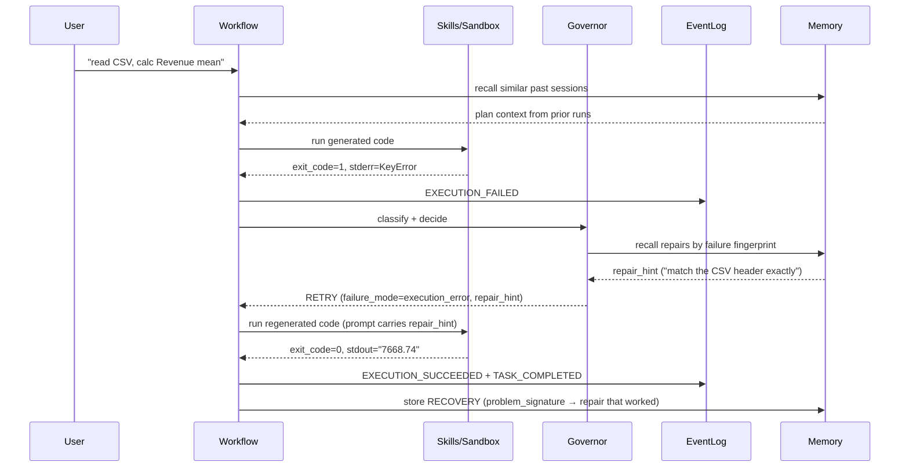
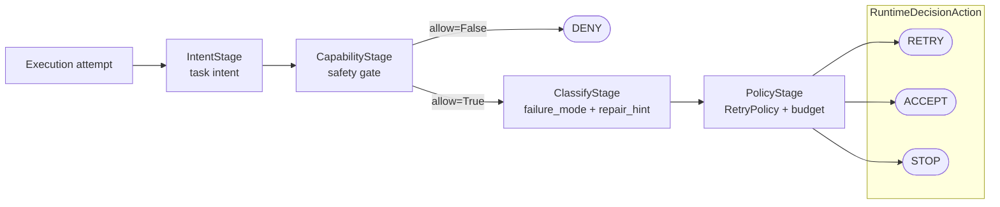

# Reforge

[](https://github.com/Judy-Liu118/Reforge/actions/workflows/test.yml)


English | [简体中文](README.zh-CN.md)

**An execution-reliability runtime for AI agents.** Reforge runs LLM-generated
Python in a sandbox and owns what happens when that code fails. A failed
attempt is classified by rules into a typed `failure_mode`, matched against
structural fingerprints of past failures, and retried with a `repair_hint`
recalled from memory. Retry / accept / stop is decided by an explicit governor
pipeline outside the model, and every decision lands on an append-only event
log, so any run can be replayed and audited. Compared with a plain retry loop,
the added parts are the rule-based failure classification, the cross-session
repair memory, and the audit trail.

```
LLM      → generate code / call skill
Runtime  → execute in sandbox, capture stderr, classify failure
Governor → typed classification → targeted retry on recoverable failure,
           immediate stop on intent-driven or timeout failure
Memory   → store typed failure mode + repair strategy for next time
Events   → emit immutable facts to an append-only log
```

---

## See it work: self-heal on a failing task


```mermaid
sequenceDiagram
    participant U as User
    participant W as Workflow
    participant S as Skills/Sandbox
    participant G as Governor
    participant E as EventLog
    participant M as Memory

    U->>W: "read CSV, calc Revenue mean"
    W->>M: recall similar past sessions
    M-->>W: plan context from prior runs
    W->>S: run generated code
    S-->>W: exit_code=1, stderr=KeyError
    W->>E: EXECUTION_FAILED
    W->>G: classify + decide
    G->>M: recall repairs by failure fingerprint
    M-->>G: repair_hint ("match the CSV header exactly")
    G-->>W: RETRY (failure_mode=execution_error, repair_hint)
    W->>S: run regenerated code (prompt carries repair_hint)
    S-->>W: exit_code=0, stdout="7668.74"
    W->>E: EXECUTION_SUCCEEDED + TASK_COMPLETED
    W->>M: store RECOVERY (problem_signature → repair that worked)
```

The decision layer and its memory-recalled repair hints sit behind one env
flag, so the comparison is an ablation on the same model, task and sandbox:

```bash
# On  — typed governor pipeline (Intent → Capability → Classify → Policy)
reforge "read sales.csv, calc revenue mean"

# Off — naive while-retry baseline (exit_code != 0 → RETRY, else ACCEPT)
REFORGE_GOVERNOR_BYPASS=1 reforge "read sales.csv, calc revenue mean"
# PowerShell: $env:REFORGE_GOVERNOR_BYPASS="1"; reforge "read sales.csv, calc revenue mean"
```

Reflection-based root-cause context is part of the base loop and stays on in
both arms — the flag isolates the decision layer plus recall. Behavioural
contract: `reforge/tests/test_governor_bypass.py`. What the layer measurably
buys is in [Evaluation methodology](#evaluation-methodology).

> Demo recording: [`docs/demo/record.md`](docs/demo/record.md) — one
> `asciinema rec` produces a cast/GIF of failure → recovery on a single task.

---

## What the governor layer adds

Every execution attempt resolves through four stages; a capability denial
returns before classification and policy ever run.


```mermaid
flowchart LR
    E[Execution attempt] --> I[IntentStage<br/>task intent]
    I --> C[CapabilityStage<br/>safety gate]
    C -->|allow=False| D([DENY])
    C -->|allow=True| CL[ClassifyStage<br/>failure_mode + repair_hint]
    CL --> P[PolicyStage<br/>RetryPolicy + budget]
    subgraph RDA["RuntimeDecisionAction"]
        R([RETRY])
        A([ACCEPT])
        S([STOP])
    end
    P --> R
    P --> A
    P --> S
```

Both columns are this repository, one env flag apart — the same two arms the
evaluation below measures.

| Concern | Naive retry loop (`REFORGE_GOVERNOR_BYPASS=1`) | **Governor on** |
|---|---|---|
| Retry decision | `exit_code != 0` → RETRY to budget, else ACCEPT | **Governor pipeline** — Intent → Capability → Classify → Policy |
| Failure classification | None — exit code only | **Typed enum** `failure_mode` + structured `problem_signature` |
| Retry prompt | Regenerated from the same context | Carries a **`repair_hint`** recalled by failure fingerprint from prior sessions |
| Stopping early | Retries to budget | Deliberate STOP on intent-driven failure, watchdog timeout, or a repeated failure signature |

The sandbox backend (subprocess or hardened Docker), the append-only event log
with `SessionReplay`, and the three safety layers (pre-codegen request gate,
post-codegen AST guard, retry-integrity check for blank `except` / swallowed
exceptions / fake success output) are properties of the runtime and run
identically in both arms.

---

## Evaluation methodology

Three pre-registered runs on a locked BIRD SQL corpus (3 × 200 real-LLM runs,
paired per-seed 95% CIs); metrics, delta formulas and the significance rule
were locked before any real-data run.

| BIRD ablation | Naive | Governor | Paired Δ, 95% CI | Verdict |
|---|---|---|---|---|
| success_rate (run 2) | 61.0% | 61.0% | 0.0pp [-4.4, +4.4] | consistent with noise |
| success_rate (run 3, shipped runtime) | 62.0% | 61.0% | -1.0pp [-9.1, +7.1] | consistent with noise |
| tokens per solved (run 3) | 4,644 | 7,351 | +2,707 [+1,199, +4,215] | **significant** — 1.6× cost |

Retry-with-reflection pays off where a first attempt fails *loudly* (timeout,
traceback), not where a wrong answer exits cleanly: in run 3, 30 of the governor
arm's 31 retries were triggered by a clean-exit attempt (exit 0, no traceback, no
timeout) that the evaluator rejected on a surface signal — an empty result set,
or a value its heuristics flagged as suspicious — not by verifying the answer,
which a rule-based evaluator with no gold access cannot do. All 30 turned out
comparator-wrong, but with no crash to key on the repeated-signature detector
never fired and generic unrecoverability recognition remains open
([`docs/KNOWN_LIMITATIONS.md`](docs/KNOWN_LIMITATIONS.md) L3). More directly,
its trigger condition — two consecutive loud failures with the same signature —
had no raw material: loud failures are near-absent (2 / 2 / 1 attempts across
the three runs) and no run ever produced two in a row. Run 1 measured
a pre-calibration evaluator that rejected correct answers; the fix was
validated held-out (FN 42.7% → 0.0%) before run 2.

Scope: BIRD failures are almost all wrong answers that exit cleanly, so this
mechanism's trigger condition is close to absent from the corpus — what these
runs locate is the boundary of where it applies, and workloads dominated by
loud failures (timeouts, tracebacks) are not measured here. See
[related work & positioning](docs/eval/RELATED_WORK.md) for how this null
locates against the Reflexion and Olausson et al. results.

Full record — pre-registration, locked corpora, instrument calibration, all
three runs: [`docs/eval/`](docs/eval/). Memory ablation (cold vs warm
substrate, 5 seeds): no KPI reaches significance, see
[`docs/experience_benchmark.md`](docs/experience_benchmark.md). Earlier 10-case
descriptive snapshot: [`docs/benchmark_sample.md`](docs/benchmark_sample.md).

Outside the ablation, the descriptive record on real datasets: 24 Auto-EDA
stages across `iris` / `titanic` / `wine`, 2 recovered after a failed attempt,
0 hard failures (single arm, no baseline comparison).

---

## Quick start

```bash
git clone https://github.com/Judy-Liu118/Reforge.git && cd Reforge
python -m venv .venv
.venv\Scripts\activate      # Windows — macOS/Linux: source .venv/bin/activate
pip install -e ".[test]"

cp .env.example .env        # fill in your LLM key

# Run a task — sandbox + governor + memory + event log all engaged
reforge "read sales.csv, calculate revenue average"

# Web dashboard — live events, sessions, memory, skills
reforge --serve             # http://localhost:8080

# Hardened sandbox (opt-in): python:3.11-slim, --network=none, mem/cpu/pids limits
$env:REFORGE_SANDBOX_BACKEND="docker"   # PowerShell — bash: export REFORGE_SANDBOX_BACKEND=docker
reforge "..."
```

---

## Applications

The runtime is exercised on real tasks, each with a reproducible report under
`docs/`:

- **Auto-EDA** — 8-stage profiling of a CSV; UCI/OpenML `iris` / `titanic` /
  `wine_quality` (24 stages, 2 recoveries, 0 hard failures). `docs/eda_*.md`.
- **Text-to-SQL** — NL→SQL through the runtime, order-insensitive exec-match
  grading (BIRD/Spider convention). `docs/sql_toy_bench.md`.
- **HPO** — N sklearn-pipeline trials per case, result-is-truth grading +
  plateau detection. `docs/hpo_toy_bench.md`.

---

## Architecture

Four runtime layers, each owning a sub-state and a hard responsibility
boundary:

| Layer | Writes | Owns |
|---|---|---|
| Sandbox executor | `exec_state` | stdout / stderr / exit_code |
| Governor | `control_state` | retry decision + policy reason |
| Reflection + Eval | `semantic_state` | intent, reflection, evaluation signals |
| Outcome resolver | `outcome_state` | final outcome + answer |

Subsystem contracts (produces / consumes / must-not) are enforced by contract
tests. Full detail in [`docs/ARCHITECTURE.md`](docs/ARCHITECTURE.md) and
[`OWNERSHIP.md`](OWNERSHIP.md).

```
reforge/
├── runtime/
│   ├── orchestration/   governor pipeline · LangGraph nodes · evaluation
│   ├── events/          event log + persistence + projection
│   ├── skills/          Skill Protocol + builtin/
│   ├── mcp/             stdio JSON-RPC client + Skill adapter
│   └── policy/          RetryPolicy + TaskIntent
├── memory/              3-layer substrate behind one Protocol (JSON / SQLite)
├── observability/       tracing + stdlib web dashboard
├── cli/                 single-shot + REPL
└── benchmark/           quantitative runtime evaluation
```

---

## Stats

| Metric | Value |
|---|---|
| Tests | green on CI — see badge above |
| Largest source file | 436 lines (no god-files) |
| Memory backends | 2 (JSON, SQLite) behind one Protocol |
| MCP transport | hand-rolled stdio JSON-RPC (no SDK) |
| Sandbox backends | 2 (subprocess, Docker) behind one Protocol |

---

## License

MIT — built as a demonstration artefact: agent execution-runtime architecture
you can run, read, and benchmark.
