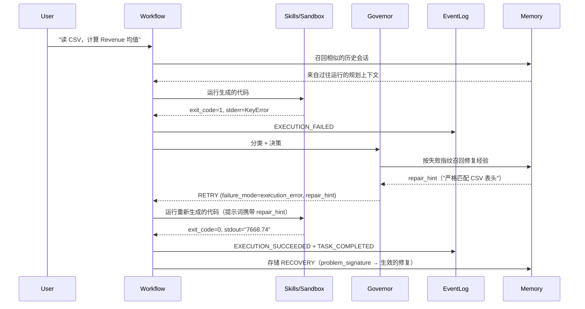

# Reforge

[](https://github.com/Judy-Liu118/Reforge/actions/workflows/test.yml)


[English](README.md) | 简体中文

**面向 AI Agent 的执行可靠性运行时（execution-reliability runtime）。**
把重试决策从模型手里拿出来，放进一个显式、强类型、可审计的运行时层——
当任务以可恢复的方式失败时，由运行时对失败进行分类、从记忆中召回历史修复
经验，并携带针对性提示进行重试，而不是盲目循环。

---

## 一张图看懂核心思路

大多数 Agent 框架让 LLM 在工具循环内决定一切。Reforge 把这个关系倒转过来：
执行是第一等公民层，模型只是其中的一个组件。

```
LLM      → 生成代码 / 调用 skill
Runtime  → 在沙箱中执行，捕获 stderr，对失败分类
Governor → 类型化分类 → 可恢复失败时进行有针对性的重试，
           意图驱动的失败或超时则立即停止
Memory   → 存储类型化的 failure_mode + 修复策略，供下次使用
Events   → 向 append-only 日志写入不可变事实
```

在可恢复失败上的结果：每次重试都由类型化的 `failure_mode` 和从记忆中召回的
`repair_hint` 塑形，而不是对 `exit_code != 0` 的朴素 while-retry。对于任务
意图驱动的失败（`EXPECTED_ERROR` / `TRACEBACK_DEMO`，由 IntentStage 从用户
请求中一次性分类得出——并非从运行时执行历史中推断）以及 watchdog 超时，
governor 会立即发出 STOP，而不是烧光预算。在这两条路径之外，governor 与朴素
基线会重试到相同的预算——这是否换来更好的结果是一个**被测量的问题，而不是
口号**：下方预注册的 BIRD 消融实验在 success_rate 上返回了一个诚实的
null（该机制的价值集中在首次尝试*响亮地*失败的场景）。不可恢复性识别现已
覆盖"重复相同失败"的情形——连续两次尝试出现相同的结构指纹会触发一次
deliberate STOP（`repeated_failure_signature`），而不是烧掉剩余预算。该检测器
是在前两轮 Phase 1 之后落地的；带着它的第三轮完整运行复现了 null，并测得该
检测器**在本语料上处于休眠状态**——BIRD 的重试几乎全是安静的评估器拒绝，
没有 traceback 可供指纹匹配。超出"响亮且持续"情形的通用不可恢复性识别仍是
开放问题（[`docs/KNOWN_LIMITATIONS.md`](docs/KNOWN_LIMITATIONS.md) L3）。
每个决策都落在 append-only 事件日志上，因此任何一次运行都可以在事后重放与
审计。

---

## 看它工作：在失败任务上自愈



诚实的对比方式是**消融实验，而不是产品竞速**：同一模型、同一任务，governor
决策层及其记忆召回的修复提示**关闭** vs **开启**。运行时层关闭时，朴素重试
循环要么烧光预算、要么放弃、要么信心满满地返回一个错误答案，且没有任何审计
痕迹。开启时，失败会被分类，重试提示词携带按失败指纹召回的修复提示，整次
运行可以从事件日志完整重放。（基于反思的根因上下文属于基础循环，在两个实验
臂中都保持开启——这个开关隔离的是决策层 + 召回，而不是记忆的所有用途。）
这是*机制*层面的对比；它在测量上到底换来了什么，见下方
[评测方法论](#评测方法论)，包括它一无所获的地方。

这个开关是真实的环境变量，不是口号：

```bash
# 开 — 类型化 governor 流水线（Intent → Capability → Classify → Policy）
reforge "read sales.csv, calc revenue mean"

# 关 — 朴素 while-retry 基线（exit_code != 0 → RETRY，否则 ACCEPT）
REFORGE_GOVERNOR_BYPASS=1 reforge "read sales.csv, calc revenue mean"
# PowerShell: $env:REFORGE_GOVERNOR_BYPASS="1"; reforge "read sales.csv, calc revenue mean"
```

同一模型、同一任务、同一沙箱——只有决策层不同。行为契约见
`reforge/tests/test_governor_bypass.py`。

> 演示录像：[`docs/demo/record.md`](docs/demo/record.md) —— 一次
> `asciinema rec` 产出单个任务上"失败 → 恢复"的 cast/GIF。

---

## 与其他方案的差异（概念层面）

这是架构层面的对比，**不是**针对这些产品的基准测试声明。

| 关注点 | LLM 主导的 Agent | **Reforge** |
|---|---|---|
| 重试决策 | 模型在工具循环内自行决定 | **Governor 流水线**（Intent → Capability → Classify → Policy）——类型化分类驱动有针对性的重试提示，而非自由裁量 |
| 失败分类 | 自然语言 | **类型化枚举** `failure_mode` + 结构化 `problem_signature` |
| 跨会话学习 | 每次运行冷启动 | **记忆基座** —— 类型化记录、结构化召回（不只是向量检索） |
| 可审计性 | 对话历史 | **Append-only 事件日志** + `SessionReplay` 重建 |
| 安全 | 命令审批 | **3 层防护**：代码生成前的请求门禁（对 user_request 做正则）+ 生成后的 AST 守卫 + 重试完整性检查（捕获空 `except`、吞掉的异常、伪造的成功输出） |
| 沙箱 | 宿主 shell / 单一容器 | **可插拔后端** —— subprocess（默认）或加固版 Docker |

---

## 评测方法论

**TL;DR** —— 在锁定的 BIRD SQL 语料上进行了三轮预注册运行（3 × 200 次，
真实 LLM，按 seed 配对的置信区间）：governor **没有移动 success_rate**
（run 2：61.0% vs 61.0%，Δ 95% CI [-4.4, +4.4]pp；run 3：61.0% vs 62.0%，
CI [-9.1, +7.1]pp），且 tokens-per-solved 成本为 1.4–1.6 倍。过程中，
预注册的敏感性附录发现内部评估器在系统性地拒绝正确答案（run 1），修复在
held-out 数据上得到验证（FN 42.7% → 0.0%），一次完整重跑确认 null 是真实的
（run 2），最后一轮在评测后落地的 repeated-signature 检测器开启的情况下运行，
显示它在此工作负载上从不触发（run 3）。直白的解读：retry-with-reflection
在首次尝试*响亮地*失败（超时、traceback——见 Phase 0）的地方有回报，在错误
答案干净退出的地方没有。这里交付的是一条经过校准的边界，不是一场庆功。

完整记录在 `docs/eval/`。方法论是预注册的——指标、配对差值公式、token 用量
缺失时的哨兵规则、显著性判定规则，全部在任何真实数据运行**之前**锁定，因此
任何为了让数字好看而做的事后修改都会原形毕露。

- [`docs/eval/PHASE0_METRICS.md`](docs/eval/PHASE0_METRICS.md) ——
  预注册记录（v4，已签署）。预注册假设被收窄为单一支柱——*governor 提升
  可恢复失败上的恢复质量*（recovery rate、solved 任务的尝试次数、tokens per
  solved）——而 Phase 1 run 2 随后在其上返回了 **null**；预注册按原样保留，
  因为假设不能在拿到数据之后再改。Tier B 指标（deliberate-STOP 的
  precision/recall、false-stop rate）被显式推迟，因为预注册时 governor 还
  没有基于历史的不可恢复性检测器；repeated-signature 检测器在 Phase 1 之后
  落地，针对变更后系统的全新运行（run 3）测得其在本语料上**零次激活**——
  Tier B 在 BIRD 上是"无定义"而非"推迟"（见 KNOWN_LIMITATIONS L3）。头条
  结论要求配对 95% CI 不跨零；"与噪声一致"的差值可以出现在表格里，但绝不
  出现在头条文案中。
- [`docs/eval/PHASE0_CORPUS.md`](docs/eval/PHASE0_CORPUS.md) —— 锁定的校准
  语料（5 个 BIRD-simple 选题 + 4 个手工构造的 toy 用例，包括探测
  deliberate-STOP 代码路径的超时诱饵）。
- [`docs/eval/PHASE0_CALIBRATION.md`](docs/eval/PHASE0_CALIBRATION.md) ——
  Phase 0 仪器校准：2026-07-10 判定 **GO**，在 memory→repair_hint 回路
  端到端打通、驱动器获得按 (mode, seed) 的冷启动记忆隔离之后重新运行；
  四个机制门禁全部通过（bypass 路径切换、governor 流水线触发、超时
  deliberate-STOP 可达、seed 全链路贯通）。
- [`docs/eval/PHASE1_BIRD_ABLATION.md`](docs/eval/PHASE1_BIRD_ABLATION.md) ——
  Phase 1 BIRD 消融 **run 1**（2026-07-11，历史记录——测量的是校准前的
  系统）：20 个锁定用例 × 2 臂 × 5 seed（200 次运行），记录字段以 SQL
  比较器为准，语料在运行前冻结
  （[`PHASE1_CORPUS.md`](docs/eval/PHASE1_CORPUS.md)）。success_rate 上为
  null（两臂均 65.0%），tokens-per-solved 为 3.1 倍，且预注册的敏感性附录
  返回 **ASYMMETRIC**：内部评估器拒绝了 governor 臂 80.8% 的比较器判定
  正确的尝试，重试循环大多在重新求解已解决的用例（100 次运行中 34 次；
  3 次丢掉了正确答案；5 次真正的恢复）。这触发了 KNOWN_LIMITATIONS 的 L6
  条款，并将该轴 gate 在评估器修复上。
- [`docs/eval/EVALUATOR_CALIBRATION.md`](docs/eval/EVALUATOR_CALIBRATION.md) ——
  门禁性修复，在 **held-out** 数据上验证（300 个 Phase 1 选题从未触碰过的
  池内问题）：评估器现在能识别请求中显式的输出格式契约，不再惩罚符合契约
  的标量答案。正确输出上的 FN 率 42.7% → 0.0%，拒绝完整性零回归。旧的
  run-1 记录没有重新打分——评估器驱动运行时的重试决策，只有全新运行才能
  测量修复后的系统。
- [`docs/eval/PHASE1_BIRD_ABLATION_R2.md`](docs/eval/PHASE1_BIRD_ABLATION_R2.md) ——
  Phase 1 **run 2**（2026-07-11，校准后——L3 之前运行时的关键结果），
  相同的锁定语料和协议。敏感性附录：两臂评估器 FN 均为 0.0%，**判定
  symmetric**——头条结论无需限定条件。**主指标上的 null 是真实的，不是
  伪影**：success_rate 61.0% vs 61.0%（配对 Δ 95% CI [-4.4%, +4.4%]）；
  recovery_rate +6.5pp 但 CI 跨零（100 次 governor 运行中 3 次真正恢复，
  全部由真实失败触发——零假阴性空转）。显著差值仍在成本侧，但修复后大幅
  收窄：tokens-per-solved 1.4 倍（原 3.1 倍），墙钟时间 1.5 倍（原 3.2 倍）。
  直白解读：在单发 BIRD SQL 上，retry-with-reflection 很少能把语义错误的
  查询改对——governor 在此语料上的测量价值受限于首次尝试响亮失败的稀有
  程度，而这一点现在由校准过的仪器明确陈述，而不是藏在评估器噪声后面。
- [`docs/eval/PHASE1_BIRD_ABLATION_R3.md`](docs/eval/PHASE1_BIRD_ABLATION_R3.md) ——
  Phase 1 **run 3**（2026-07-13，L3 repeated-signature 检测器开启——
  **已发布运行时的记录**），相同的锁定语料和协议。null 第三次复现：
  success_rate 61.0% vs 62.0%（配对 Δ 95% CI [-9.1, +7.1]pp）；敏感性附录
  再次 symmetric（两臂评估器 FN 0.0%）。检测器本身在 200 次运行中记录
  **零次激活**，原始记录说明了原因：governor 臂 31 次重试尝试中的 30 次是
  安静的评估器拒绝（exit 0，无 traceback——指纹历史无从匹配），且没有任何
  一次运行出现连续两次响亮失败。因此 run 3 的 governor 逐决策地做出了与
  run-2 运行时完全相同的选择，成本差值与 run 2 在统计上一致
  （tokens-per-solved 1.6 倍 vs 1.4 倍，CI 重叠）。一个诚实的瑕疵，公开
  而非掩埋：first_try_rate 的 seed 级 Δ（-5.0pp，CI [-9.4, -0.6]）名义上
  不含零，但锁定的用例级稳健性检查包含零（[-14.0, +4.0]），且两臂在构造上
  运行完全相同的第一次尝试流水线（bypass 标志只改变重试决策），因此我们
  将其解读为 seed 级噪声（df = 4）而非机制效应——它不进入头条结论。

> **早期描述性快照——早于上述预注册评测。**
> 出于透明度保留；请勿当作头条结论解读。已发布运行时的关键对比是预注册的
> Phase 1 run-3 数据
> （[`docs/eval/PHASE1_BIRD_ABLATION_R3.md`](docs/eval/PHASE1_BIRD_ABLATION_R3.md)）。

在 `deepseek-v4-pro` 上跑一遍精选的 10 用例套件，无 mock
（`docs/benchmark_sample.md`）。按原样报告，包括 actual ≠ expected 的用例——
那些是真实的调优信号，不是要藏起来的失败。

| 类别 | 用例数 | 通过 | 恢复率 | 平均尝试次数 |
|---|---|---|---|---|
| `csv_basic` | 3 | 3/3 (100%) | 0% | 1.00 |
| `csv_recovery` | 3 | 1/3 (33%) | **100%** | 2.00 |
| `denied` | 2 | 2/2 (100%) | 0% | 1.00 |
| `intentional` | 2 | 1/2 (50%) | 0% | 2.50 |
| **总计** | **10** | **7 (70%)** | **30%** | **1.60** |

- **自愈成立**：每个 `csv_recovery` 用例都以 `RECOVERED` 收尾——governor 的
  RETRY 决策得到印证并产出了正确输出。
- **安全守卫 100%**：两个 `denied_*` 用例（含 `rm -rf`、fork bomb 和一个
  提示注入变体）都在沙箱运行之前被拦截。
- **诚实的缺口**：`csv_recovery_missing_file` *预期*硬失败，但运行时恢复得
  过于激进——这是一个真实的 `TaskIntent` 调优目标，故意保留可见。该 fixture
  本身也偏弱（见 `docs/experience_benchmark.md` §8.5），将在 v3 中重做。

复现：`python -m reforge.benchmark --out docs/benchmark_sample.md`

### 记忆消融（配对、多 seed）

上面的基准是描述性的。为了对**跨会话记忆是否真的有帮助**做受控的
信号-vs-噪声判读，Experience Memory Benchmark 对每一对用例在同一指纹轴上
跑两次（Cold = 每用例全新记忆基座，Warm = 用兄弟用例预填充的基座），跨 5 个
seed 并给出 95% CI：

| KPI（warm − cold，按 seed 差值） | 均值 | 95% CI | 判定 |
|---|---|---|---|
| 迁移成功率 | +0% | [+0%, +0%] | 与噪声一致 |
| 首次尝试成功率差值 | +4% | [-7%, +15%] | 与噪声一致 |
| 尝试次数减少 | +0.04 | [-0.07, +0.15] | 与噪声一致 |

**诚实**的发现（5 对中 4 对是确定性的；P2 承担了全部方差；P3/P4 的 fixture
太简单，LLM 一次就能做对）：在这套用例上，这个记忆层**没有**达到统计显著。
这就是一个可发表的 null 结果的样子——方法论从 v0 被污染的 +20%，硬化到 v1
隔离后的 +0%，再到 v2 的多 seed 置信区间。完整的 v0 → v1 → v2 演进和 v3
路线图（修复弱 fixture、加入 Memory Influence Score 以区分"召回了"和
"用上了"）见 [`docs/experience_benchmark.md`](docs/experience_benchmark.md)。

> 协议说明：上表使用 v2 experience-memory harness 的 `N_seeds = 5`。Phase 1
> 预注册（[`docs/eval/PHASE0_METRICS.md`](docs/eval/PHASE0_METRICS.md) §3）
> 将记忆轴消融锁定为 `N_seeds = 3`，针对不同的语料和 harness——不同协议、
> 不同证据基础，有意不做平均合并。

---

## 快速开始

```bash
git clone https://github.com/Judy-Liu118/Reforge.git && cd Reforge
python -m venv .venv
.venv\Scripts\activate      # Windows — macOS/Linux: source .venv/bin/activate
pip install -e ".[test]"

cp .env.example .env        # 填入你的 LLM key

# 运行一个任务 — 沙箱 + governor + 记忆 + 事件日志全部生效
reforge "read sales.csv, calculate revenue average"

# Web 仪表盘 — 实时事件、会话、记忆、skills
reforge --serve             # http://localhost:8080

# 加固沙箱（可选启用）：python:3.11-slim、--network=none、mem/cpu/pids 限制
$env:REFORGE_SANDBOX_BACKEND="docker"   # PowerShell — bash: export REFORGE_SANDBOX_BACKEND=docker
reforge "..."
```

---

## 应用案例

运行时在真实任务（而非合成 CSV）上得到检验，以证明自愈回路能在混乱的
真实数据上存活。每个案例在 `docs/` 下都有可复现的报告：

- **Auto-EDA** —— 对 CSV 做 8 阶段画像；在 UCI/OpenML 的 `iris` /
  `titanic` / `wine_quality` 上验证（24 个阶段，2 次恢复，0 次硬失败）。
  见 `docs/eda_*.md`。
- **Text-to-SQL** —— NL→SQL 走完整运行时，顺序无关的执行匹配评分
  （BIRD/Spider 惯例）。见 `docs/sql_toy_bench.md`。
- **HPO** —— 每用例驱动 N 次 sklearn-pipeline 试验，结果即真值的评分 +
  平台期检测。见 `docs/hpo_toy_bench.md`。

---

## 架构

`RuntimeState` **只能通过契约测试演进**——禁止的是静默双写、与嵌套子状态
重复的扁平字段（由 `reforge/tests/test_state_no_flat_fields.py` 强制执行），
而不是禁止新的顶层输入。当一个真正的任务级输入在契约测试白名单中赢得一个
payload 字段槽位时，允许添加；`image_inputs: list[str]`（声明式视觉输入，
见下文）是最近的一个例子。四个运行时层各自拥有一个子状态和一条硬性职责边界：

| 层 | 写入 | 拥有 |
|---|---|---|
| 沙箱执行器 | `exec_state` | stdout / stderr / exit_code |
| Governor | `control_state` | 重试决策 + 策略理由 |
| 反思 + 评估 | `semantic_state` | 意图、反思、评估信号 |
| 结果解析器 | `outcome_state` | 最终结果 + 答案 |

**视觉路由是按尝试次数的模型选择，不是循环前的图分支。**
`code_generation_node` 在每次尝试时根据 `bool(state.image_inputs)` 在文本
LLM 与多模态 LLM 之间选择；视觉输入由调用方通过
`RuntimeRunner.run(user_request, image_inputs=[...])` 一次性声明，且在整个
循环中任务级不可变（`RuntimeRunner.stream` 中的边界不变量会在任何节点修改
该字段时抛出异常）。此前"文件系统扫描 + 视觉意图正则"的路由方式已被移除；
"用户声明的输入图片"与"数据任务恰好向工作区写了一张 PNG"之间的消歧现在是
结构性的，而不是启发式的。

子系统契约（产出 / 消费 / 禁止事项）由契约测试强制执行。完整细节见
[`docs/ARCHITECTURE.md`](docs/ARCHITECTURE.md) 和
[`OWNERSHIP.md`](OWNERSHIP.md)。

```
reforge/
├── runtime/
│   ├── orchestration/   governor 流水线 · LangGraph 节点 · 评估
│   ├── events/          事件日志 + 持久化 + 投影
│   ├── skills/          Skill Protocol + builtin/ + MCP 客户端
│   └── policy/          RetryPolicy + TaskIntent
├── memory/              单一 Protocol 之后的 3 层记忆基座（JSON / SQLite）
├── observability/       链路追踪 + 纯标准库 Web 仪表盘
├── cli/                 单发 + REPL
└── benchmark/           运行时量化评测
```

---

## 统计

| 指标 | 数值 |
|---|---|
| 测试 | CI 全绿 — 见上方徽章 |
| 最大源文件 | 436 行（没有上帝文件） |
| 记忆后端 | 2 个（JSON、SQLite），共用一个 Protocol |
| MCP 传输 | 手写 stdio JSON-RPC（未用 SDK） |
| 沙箱后端 | 2 个（subprocess、Docker），共用一个 Protocol |

---

## 许可证

MIT —— 作为演示制品构建：一个你可以运行、阅读、评测的 Agent 执行运行时
架构。
