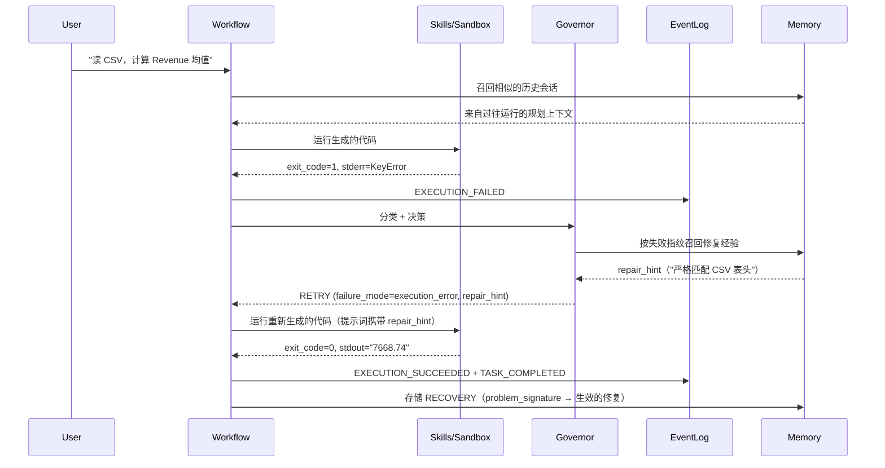
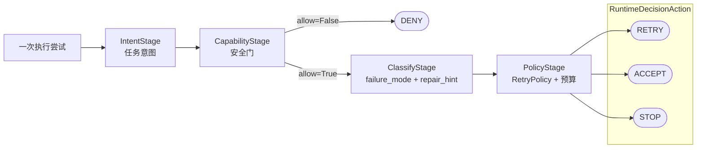

# Reforge

[](https://github.com/Judy-Liu118/Reforge/actions/workflows/test.yml)


[English](README.md) | 简体中文

**面向 AI Agent 的执行可靠性运行时（execution-reliability runtime）。**
Reforge 在沙箱里执行 LLM 生成的 Python，并负责这段代码失败之后的事情。失败的
尝试会被规则分类成类型化的 `failure_mode`，与历史失败的结构指纹做匹配，并携带
从记忆中召回的 `repair_hint` 重试。重试 / 接受 / 停止由模型之外的显式 governor
流水线决定，每个决策都落在 append-only 事件日志上，因此任何一次运行都可以事后
重放与审计。相比朴素的重试循环，多出来的部分是：基于规则的失败分类、跨会话的
修复记忆，以及审计痕迹。

```
LLM      → 生成代码 / 调用 skill
Runtime  → 在沙箱中执行，捕获 stderr，对失败分类
Governor → 类型化分类 → 可恢复失败时进行有针对性的重试，
           意图驱动的失败或超时则立即停止
Memory   → 存储类型化的 failure_mode + 修复策略，供下次使用
Events   → 向 append-only 日志写入不可变事实
```

---

## 看它工作：在失败任务上自愈


```mermaid
sequenceDiagram
    participant U as User
    participant W as Workflow
    participant S as Skills/Sandbox
    participant G as Governor
    participant E as EventLog
    participant M as Memory

    U->>W: "读 CSV，计算 Revenue 均值"
    W->>M: 召回相似的历史会话
    M-->>W: 来自过往运行的规划上下文
    W->>S: 运行生成的代码
    S-->>W: exit_code=1, stderr=KeyError
    W->>E: EXECUTION_FAILED
    W->>G: 分类 + 决策
    G->>M: 按失败指纹召回修复经验
    M-->>G: repair_hint（"严格匹配 CSV 表头"）
    G-->>W: RETRY (failure_mode=execution_error, repair_hint)
    W->>S: 运行重新生成的代码（提示词携带 repair_hint）
    S-->>W: exit_code=0, stdout="7668.74"
    W->>E: EXECUTION_SUCCEEDED + TASK_COMPLETED
    W->>M: 存储 RECOVERY（problem_signature → 生效的修复）
```

决策层及其记忆召回的修复提示挂在一个环境变量后面，因此这个对比是同一模型、
同一任务、同一沙箱下的消融实验：

```bash
# 开 — 类型化 governor 流水线（Intent → Capability → Classify → Policy）
reforge "read sales.csv, calc revenue mean"

# 关 — 朴素 while-retry 基线（exit_code != 0 → RETRY，否则 ACCEPT）
REFORGE_GOVERNOR_BYPASS=1 reforge "read sales.csv, calc revenue mean"
# PowerShell: $env:REFORGE_GOVERNOR_BYPASS="1"; reforge "read sales.csv, calc revenue mean"
```

基于反思的根因上下文属于基础循环，在两个实验组中都保持开启——这个开关隔离的
是决策层 + 召回。行为契约见 `reforge/tests/test_governor_bypass.py`。它在测量上
到底换来了什么，见[评测方法论](#评测方法论)。

> 演示录像：[`docs/demo/record.md`](docs/demo/record.md) —— 一次
> `asciinema rec` 产出单个任务上"失败 → 恢复"的 cast/GIF。

---

## Governor 这一层加了什么

每一次执行尝试都要走完四个阶段；capability 拒绝时直接返回，分类与策略根本不会
执行。


```mermaid
flowchart LR
    E[一次执行尝试] --> I[IntentStage<br/>任务意图]
    I --> C[CapabilityStage<br/>安全门]
    C -->|allow=False| D([DENY])
    C -->|allow=True| CL[ClassifyStage<br/>failure_mode + repair_hint]
    CL --> P[PolicyStage<br/>RetryPolicy + 预算]
    subgraph RDA["RuntimeDecisionAction"]
        R([RETRY])
        A([ACCEPT])
        S([STOP])
    end
    P --> R
    P --> A
    P --> S
```

两列都是本仓库，相差一个环境变量——正是下方评测所测的两个实验组。

| 关注点 | 朴素重试循环（`REFORGE_GOVERNOR_BYPASS=1`） | **Governor 开启** |
|---|---|---|
| 重试决策 | `exit_code != 0` → 重试到预算上限，否则 ACCEPT | **Governor 流水线** —— Intent → Capability → Classify → Policy |
| 失败分类 | 没有 —— 只看退出码 | **类型化枚举** `failure_mode` + 结构化 `problem_signature` |
| 重试提示词 | 用同样的上下文重新生成 | 携带按失败指纹从历史会话召回的 **`repair_hint`** |
| 提前停止 | 一路重试到预算上限 | 意图驱动的失败、watchdog 超时、或重复失败指纹时 deliberate STOP |

沙箱后端（subprocess 或加固版 Docker）、append-only 事件日志 + `SessionReplay`
重建，以及三层安全防护（代码生成前的请求门禁、生成后的 AST 守卫、重试完整性
检查——捕获空 `except`、吞掉的异常、伪造的成功输出），都是运行时本身的属性，
在两个实验组里完全一致。

---

## 评测方法论

在锁定的 BIRD SQL 语料上进行了三轮预注册运行（3 × 200 次真实 LLM 运行，按 seed
配对的 95% 置信区间）；指标、差值公式和显著性判定规则在任何真实数据运行之前
锁定。

| BIRD 消融 | 朴素基线 | Governor | 配对 Δ，95% CI | 判定 |
|---|---|---|---|---|
| success_rate（run 2） | 61.0% | 61.0% | 0.0pp [-4.4, +4.4] | 与噪声一致 |
| success_rate（run 3，已发布运行时） | 62.0% | 61.0% | -1.0pp [-9.1, +7.1] | 与噪声一致 |
| tokens per solved（run 3） | 4,644 | 7,351 | +2,707 [+1,199, +4,215] | **显著** —— 1.6 倍成本 |

retry-with-reflection 在首次尝试*响亮地*失败（超时、traceback）的地方有回报，
在错误答案干净退出的地方没有：governor 组 31 次重试中有 30 次是安静的评估器
拒绝，因此 repeated-signature 检测器从未触发，通用的不可恢复性识别仍是开放问题
（[`docs/KNOWN_LIMITATIONS.md`](docs/KNOWN_LIMITATIONS.md) L3）。run 1 测量的是
校准前的评估器，它会拒绝正确答案；该修复在 held-out 数据上验证（FN 42.7% →
0.0%）之后才跑了 run 2。

适用范围：BIRD 的失败几乎全是干净退出的错误答案，该机制的触发条件在这个语料上
近乎不存在——这几轮运行定位的是它的适用边界；以响亮失败（超时、traceback）
为主的工作负载在这里未被测量。

完整记录——预注册、锁定语料、仪器校准和三轮运行：[`docs/eval/`](docs/eval/)。
记忆消融（冷 vs 暖记忆基座，5 个 seed）：没有 KPI 达到统计显著，见
[`docs/experience_benchmark.md`](docs/experience_benchmark.md)。更早的 10 用例
描述性快照：[`docs/benchmark_sample.md`](docs/benchmark_sample.md)。

消融实验之外，真实数据集上的描述性记录：`iris` / `titanic` / `wine` 共 24 个
Auto-EDA 阶段，2 个在失败后恢复，0 次硬失败（单组，无基线对照）。

---

## 快速开始

```bash
git clone https://github.com/Judy-Liu118/Reforge.git && cd Reforge
python -m venv .venv
.venv\Scripts\activate      # Windows — macOS/Linux: source .venv/bin/activate
pip install -e ".[test]"

cp .env.example .env        # 填入你的 LLM key

# 运行一个任务 — 沙箱 + governor + 记忆 + 事件日志全部生效
reforge "read sales.csv, calculate revenue average"

# Web 仪表盘 — 实时事件、会话、记忆、skills
reforge --serve             # http://localhost:8080

# 加固沙箱（可选启用）：python:3.11-slim、--network=none、mem/cpu/pids 限制
$env:REFORGE_SANDBOX_BACKEND="docker"   # PowerShell — bash: export REFORGE_SANDBOX_BACKEND=docker
reforge "..."
```

---

## 应用案例

运行时在真实任务上得到检验，每个案例在 `docs/` 下都有可复现的报告：

- **Auto-EDA** —— 对 CSV 做 8 阶段画像；在 UCI/OpenML 的 `iris` / `titanic` /
  `wine_quality` 上验证（24 个阶段，2 次恢复，0 次硬失败）。`docs/eda_*.md`。
- **Text-to-SQL** —— NL→SQL 走完整运行时，顺序无关的执行匹配评分
  （BIRD/Spider 惯例）。`docs/sql_toy_bench.md`。
- **HPO** —— 每用例驱动 N 次 sklearn-pipeline 试验，结果即真值的评分 + 平台期
  检测。`docs/hpo_toy_bench.md`。

---

## 架构

四个运行时层，各自拥有一个子状态和一条硬性职责边界：

| 层 | 写入 | 拥有 |
|---|---|---|
| 沙箱执行器 | `exec_state` | stdout / stderr / exit_code |
| Governor | `control_state` | 重试决策 + 策略理由 |
| 反思 + 评估 | `semantic_state` | 意图、反思、评估信号 |
| 结果解析器 | `outcome_state` | 最终结果 + 答案 |

子系统契约（产出 / 消费 / 禁止事项）由契约测试强制执行。完整细节见
[`docs/ARCHITECTURE.md`](docs/ARCHITECTURE.md) 和
[`OWNERSHIP.md`](OWNERSHIP.md)。

```
reforge/
├── runtime/
│   ├── orchestration/   governor 流水线 · LangGraph 节点 · 评估
│   ├── events/          事件日志 + 持久化 + 投影
│   ├── skills/          Skill Protocol + builtin/ + MCP 客户端
│   └── policy/          RetryPolicy + TaskIntent
├── memory/              单一 Protocol 之后的 3 层记忆基座（JSON / SQLite）
├── observability/       链路追踪 + 纯标准库 Web 仪表盘
├── cli/                 单发 + REPL
└── benchmark/           运行时量化评测
```

---

## 统计

| 指标 | 数值 |
|---|---|
| 测试 | CI 全绿 — 见上方徽章 |
| 最大源文件 | 436 行（没有上帝文件） |
| 记忆后端 | 2 个（JSON、SQLite），共用一个 Protocol |
| MCP 传输 | 手写 stdio JSON-RPC（未用 SDK） |
| 沙箱后端 | 2 个（subprocess、Docker），共用一个 Protocol |

---

## 许可证

MIT —— 作为演示制品构建：一个你可以运行、阅读、评测的 Agent 执行运行时
架构。
