# Reforge Architecture

Detailed reference for each runtime subsystem. For the elevator pitch and
quick start, see `../README.md`. For phase history, see `EVOLUTION.md`.

---

## 1. Runtime layers

Reforge separates concerns across four runtime layers, each owning a
distinct sub-state and a hard set of responsibilities (see `OWNERSHIP.md`).

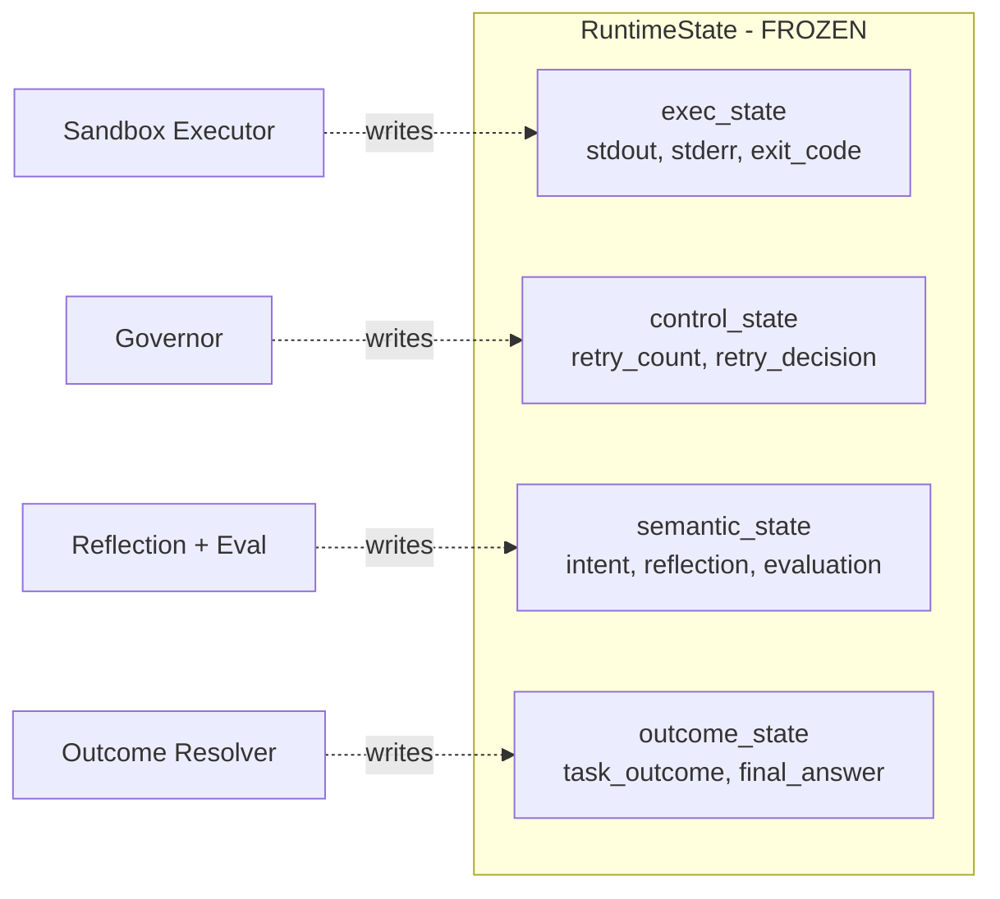

**RuntimeState is frozen** — no new top-level fields allowed. New state must
flow through `ExecutionEvent` to the append-only `ExecutionEventLog`.

---

## 2. Governor pipeline

The governor is the **single decision authority** for retry / accept / stop.
Evaluation produces signals; classification interprets them; the policy stage
makes the call. Each stage is independently testable and replaceable.

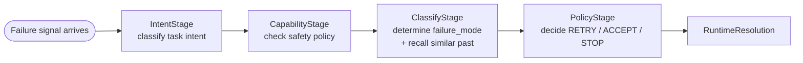

| Stage | Module | Owns |
|---|---|---|
| `IntentStage` | `governor/intent_stage.py` | `TaskIntent` classification |
| `CapabilityStage` | `governor/capability_stage.py` | `CapabilityDecision` via `SemanticSafetyGuard` |
| `ClassifyStage` | `governor/classify_stage.py` | `failure_mode` + memory recall + recurring-pattern warning |
| `PolicyStage` | `governor/policy_stage.py` | Final `PolicyDecision` |

The graph node `retry_decision_node` just calls `governor.resolve()` —
business logic lives in the governor, not in the graph.

---

## 3. Skill abstraction

A single Protocol unifies both invocation paradigms:

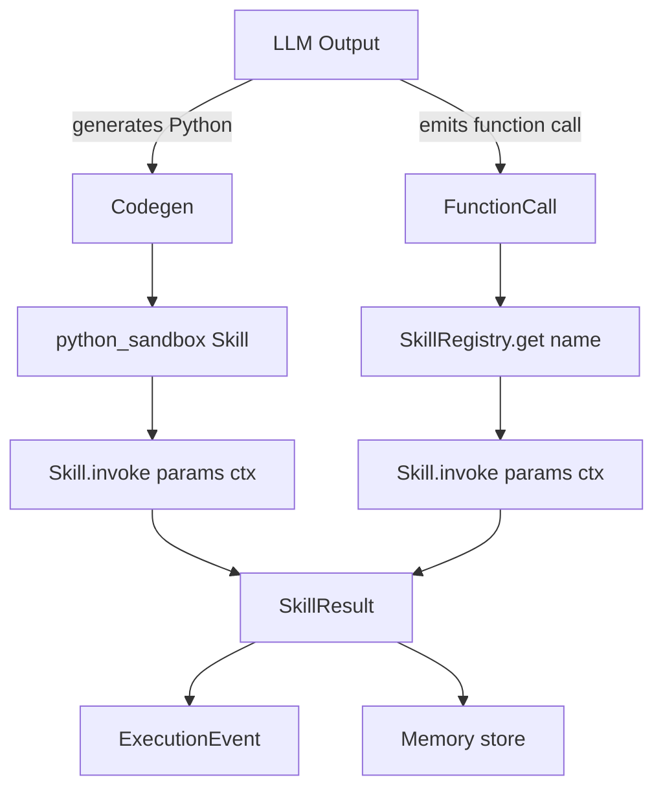

### Built-in skills

| Skill | Module | Purpose |
|---|---|---|
| `python_sandbox` | `skills/builtin/python_sandbox.py` | Code-as-action via pluggable `SandboxBackend` |
| `read` | `skills/builtin/read.py` | Line-numbered file read, offset/limit |
| `grep` | `skills/builtin/grep.py` | Pure-Python regex search, 3 output modes |
| `glob` | `skills/builtin/glob_skill.py` | pathlib glob, mtime-sorted |
| `edit` | `skills/builtin/edit.py` | Strict-uniqueness string replacement |
| `web_search` | `skills/builtin/web_search/` | Provider-abstracted (Tavily default) |

All file skills default to `restrict_to_workspace=True` — they cannot read or
write outside `SkillContext.workspace` unless explicitly opted out.

### Sandbox backend (pluggable)

`PythonSandboxSkill` does not execute code itself — it delegates to a
`SandboxBackend`. The backend is selected at `SandboxExecutor` construction
time, so the same skill can run in two very different isolation regimes
without any caller change:

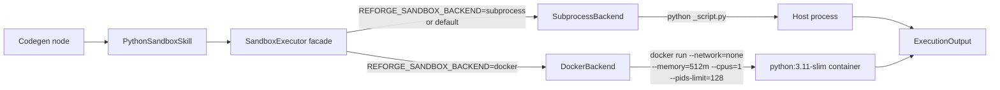

| Backend | Startup overhead | FS isolation | Network isolation | CPU / mem cap | When to use |
|---|---|---|---|---|---|
| `SubprocessBackend` (default) | ~30 ms | workspace cwd only | none | none | dev, CI, benchmarks, trusted LLM code |
| `DockerBackend` (opt-in) | ~1–3 s | full (`-v workspace:/work`) | `--network=none` | `--memory=512m --cpus=1 --pids-limit=128` | demos, untrusted code, production |

The Protocol is intentionally narrow — `execute(code, *, workspace, timeout_s) -> ExecutionOutput`
— so a third backend (firecracker, gVisor, remote sandbox API) drops in with
no facade change.

### MCP integration

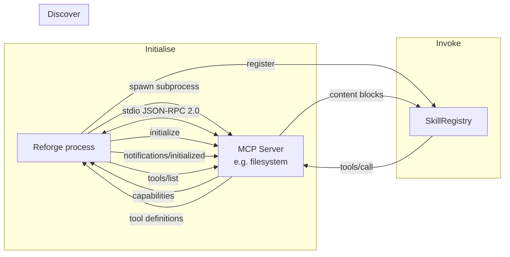

The transport (`skills/mcp/client.py`) is a hand-rolled synchronous
JSON-RPC 2.0 client over stdio. No `mcp` SDK dependency, no asyncio
infection of the runtime. The lifecycle (`skills/mcp/session.py`) handles
the initialize handshake, `tools/list` caching, `tools/call` dispatch, and
graceful shutdown with force-kill fallback.

`MCPSkill` adapts one MCP tool to the `Skill` Protocol; the registered name
is `mcp.<server>.<tool>` so multiple servers can expose same-named tools.

---

## 4. Event-sourced runtime

Every lifecycle transition emits an immutable `ExecutionEvent`. The event
log is append-only, line-buffered to disk via `PersistentEventLog`, and
exposed both for replay and for live subscription.

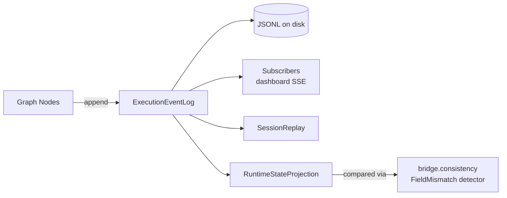

The projection layer (`runtime/events/projection.py`) reconstructs a view
of `RuntimeState` from events alone — used by the consistency validator
(`runtime/bridge/consistency.py`) to verify that no node-side mutation
drifts away from what events recorded.

This is the foundation for the long-term migration to event-sourced
RuntimeState — new state goes to `ExecutionEvent`, not new fields on
`RuntimeState` (frozen). See `CLAUDE.md` "RuntimeState — FROZEN".

### Event vocabulary

| Kind | Emitted by | Carries |
|---|---|---|
| `EXECUTION_STARTED` | execution_node | task description |
| `EXECUTION_SUCCEEDED` | execution_node | output summary |
| `EXECUTION_FAILED` | execution_node | category, recoverable flag, error, semantic_meaning |
| `RECOVERY_ATTEMPTED` | emitter wrap | strategy, attempt number |
| `EVALUATION_COMPLETED` | evaluation_node | score, passed, reasons |
| `REFLECTION_GENERATED` | reflection_node | summary |
| `POLICY_DECIDED` | retry_decision emitter | decision, reason |
| `TASK_COMPLETED` | final_response_node | outcome, reason, answer_summary |

---

## 5. Memory substrate

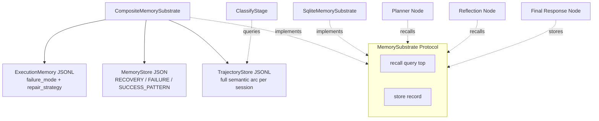

`MemorySubstrate` is a Protocol — any object satisfying `recall()` /
`store()` can be injected via `build_graph(memory_substrate=...)` or
`RuntimeRunner(memory_substrate=...)`. The default
`CompositeMemorySubstrate` wraps three layers.

### Why three layers, not one vector DB

- `ExecutionMemory` is fast-path failure→repair lookup keyed by `failure_mode`
- `MemoryStore` is the typed long-term store with classification
- `TrajectoryStore` carries the full session arc for cross-session similarity

A single vector DB would conflate signals that the runtime needs to keep
distinct. The substrate Protocol leaves room for backends like Qdrant
to be added without changing callers — but the typed layers come first.

---

## 6. Multi-agent layer

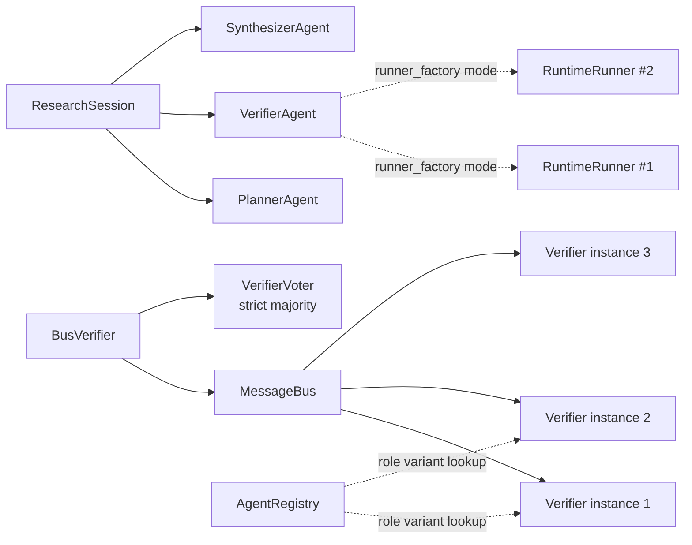

`PlannerAgent`, `VerifierAgent`, `SynthesizerAgent` are `@runtime_checkable`
Protocols. The default `RunnerVerifier` supports both shared-runner and
per-call factory modes — the latter mints a fresh `RuntimeRunner` per
verification call for worker isolation in parallel research orchestration.

`BusVerifier` fans a hypothesis out to N verifiers via `MessageBus` and
resolves the consensus through `VerifierVoter` (strict majority > 50%).
When N verifiers disagree 2-2, the outcome is `inconclusive`.

### Agent capability (runtime-level isolation)

Agents are no longer just prompt-level roles — each one carries a typed
`AgentCapability` envelope that the SkillRegistry consults at the boundary.

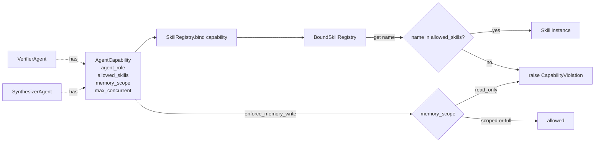

| Knob | Type | Effect |
|---|---|---|
| `allowed_skills` | `frozenset[str] \| None` | `None` = unrestricted. Otherwise registry blocks lookup. |
| `memory_scope` | `read_only` / `scoped` / `full` | `read_only` blocks write at substrate wrapper. |
| `max_concurrent` | `int >= 1` | Hint for parallel orchestration. |

Enforcement lives at the boundary (`SkillRegistry.get` / `bind`), never
inside the agent — that would defeat the point of declarative capability.

---

## 7. Observability dashboard

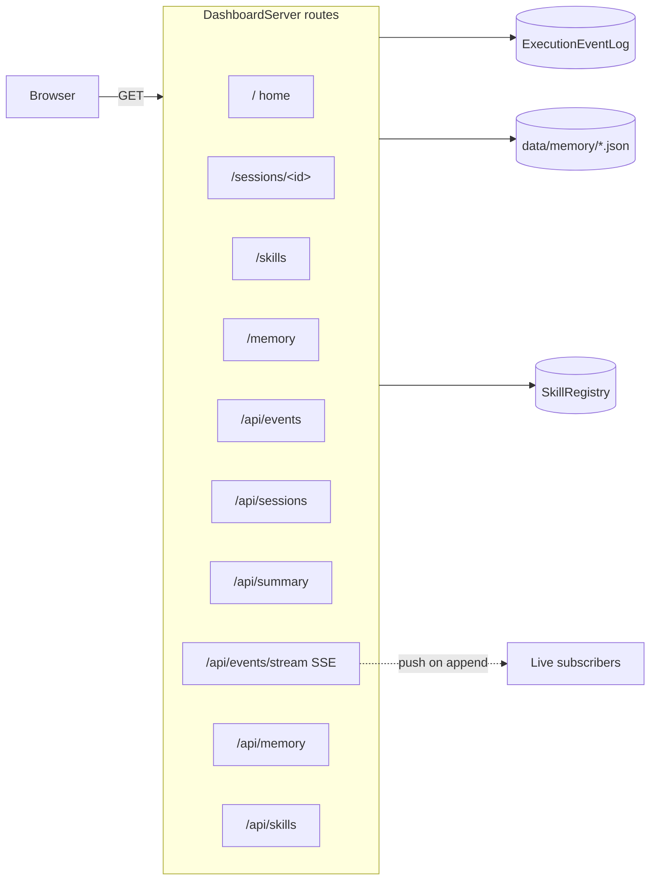

Implementation: stdlib `http.server` only. Frontend is CDN-loaded
Tailwind + Alpine.js + Chart.js inlined into `pages.py` — no static-file
shipping, no build step. The dashboard works whether the event log is
actively being written to or loaded from disk.

---

## 8. EDA application (worked example)

The first non-synthetic application built on top of the runtime —
demonstrates how a domain workflow plugs in without changing core layers.

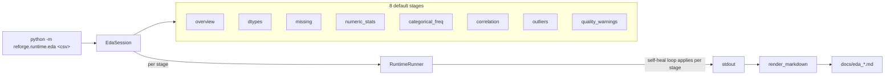

Design properties:

- **Each stage = one RuntimeRunner.run()** — every stage gets its own session_id and the full governor/reflection/retry loop, so a malformed column in stage 3 does not poison stage 4.
- **Memory substrate is shared across stages** — the runtime learns "this dataset has weird dtypes" patterns inside a single dataset run.
- **No new runtime hooks needed** — EdaSession is application code; it consumes RuntimeState exactly like the benchmark runner does.
- **Markdown reporter is deterministic** — given an `EdaReport`, the layout is fixed (overview / per-stage table / per-stage details / self-healing footer), so the diff between dataset reports is purely the data content.

Validated on 3 real datasets via `scripts/prepare_eda_datasets.py`
(iris / titanic / wine_quality) — see `docs/eda_*.md` for the captured
self-healing footprint per dataset.

---

## 9. Text-to-SQL benchmark (worked example)

Second application on top of the runtime — same architectural shape as
EDA but optimised for benchmark-style measurement against ground truth.

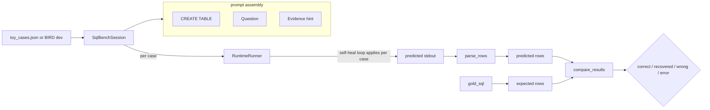

Design properties:

- **Result is source of truth**: status is decided by `compare_results`, not by `task_outcome`. A `FAILED` outcome whose final stdout happens to match gold is graded `recovered`, not `error` — the report stays honest about what the model actually produced.
- **BIRD/Spider exec_acc semantics**: order-insensitive multiset (unless `expects_ordering=True` for `ORDER BY` questions), numeric tolerance for int/float drift, NULL/whitespace canonicalisation.
- **Same pluggable substrate as everything else**: `SqlBenchSession` accepts `runner_factory` for mock-based unit testing, exactly like `BenchmarkRunner` and `EdaSession`.
- **Reusable prompt boundary**: `build_prompt(case)` constrains the LLM to "single SQL → one row per line, ` | ` separated" — keeps the parser deterministic and decouples the comparator from natural-language output formatting.

Worked example data lives in `data/sql_bench/toy_cases.json` (15
questions over a 4-table school registry). BIRD-SQL dev set is opt-in
via `scripts/prepare_bird.py` + `bird_loader.py`.

---

## 10. Subsystem boundaries

The ownership table from `OWNERSHIP.md` is enforced by contract tests:

| File | What it freezes |
|---|---|
| `tests/test_pr_workflow_split.py` | `graph/workflow.py` line budget; node files each ≤ 100 lines |
| `tests/test_pr_state_nested_only.py` | No flat fields on RuntimeState |
| `tests/test_pr_substrate_injection.py` | MemorySubstrate is reachable via `build_graph(memory_substrate=...)` |

These run on every test invocation, so any drift from the architecture is
caught immediately rather than after debt accumulates.

---

## 11. Pointers

- Audit history and historical decisions: `docs/EVOLUTION.md`
- Daily development rules: `CLAUDE.md`
- Per-subsystem ownership: `OWNERSHIP.md`
