# Reforge 架构

[English](ARCHITECTURE.md) | 简体中文

各个运行时子系统的详细参考。项目定位和快速上手见 `../README.zh-CN.md`；
阶段演进史见 `EVOLUTION.md`。

> 说明：文中的 mermaid 图保留英文原样。图里的节点标签基本都是代码里的类名、
> 字段名和环境变量，保持原文才能和源码逐一对上。

---

## 1. 运行时分层

Reforge 把关注点拆到四个运行时层，每一层独占一块子状态，职责边界是硬约束
（详见 `OWNERSHIP.md`）。

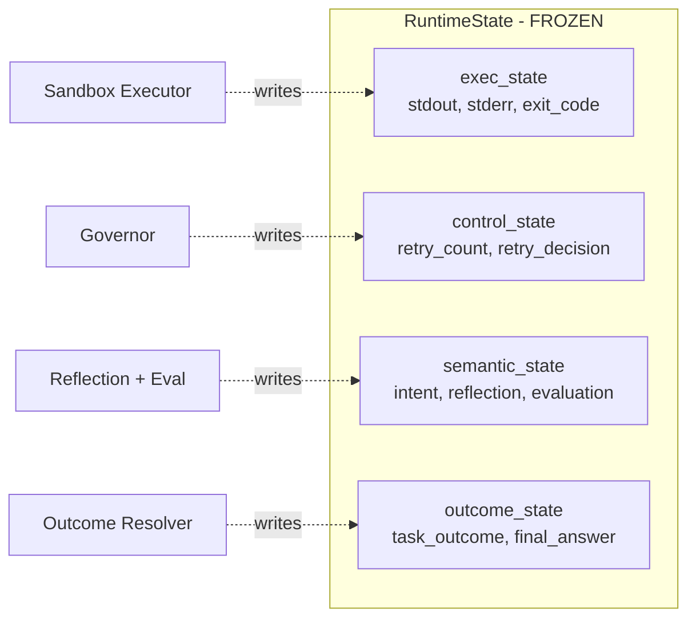

**RuntimeState 已冻结** —— 不允许再加新的顶层字段。新增状态必须以
`ExecutionEvent` 的形式流向只追加的 `ExecutionEventLog`。

### 状态演进与视觉路由

`RuntimeState` **只通过契约测试演进**。这里禁止的是"悄悄双写扁平字段、和嵌套子状态
重复"这种做法（由 `reforge/tests/test_state_no_flat_fields.py` 强制），而不是禁止新增
顶层输入。如果某个字段确实是任务级输入，并且能在契约测试的 payload 字段白名单里挣到
一个位置，就允许加入；`image_inputs: list[str]`（声明式视觉输入）就是最近一次这样的
新增。

**视觉路由是逐次尝试的模型选择，不是进入循环前的图分支。**
`code_generation_node` 在每次尝试时根据 `bool(state.image_inputs)` 在文本 LLM 和多模态
LLM 之间做选择；视觉输入由调用方通过
`RuntimeRunner.run(user_request, image_inputs=[...])` 一次性声明，并在整个循环期间保持
任务级不可变（`RuntimeRunner.stream` 里有一条边界不变量，任何节点试图改写该字段都会
抛错）。此前那套"扫描文件系统 + 视觉意图正则"的路由已被移除：现在区分"用户声明的输入
图片"和"数据任务恰好往工作区写了一个 PNG"靠的是结构，而不是启发式猜测。

### 图拓扑

`graph/workflow.py` 只负责接线 —— 八个节点、两条条件边、零业务逻辑。两条条件边指向的是
同一组目标，因此所有离开循环的路径最终都汇聚到 `final_response`：

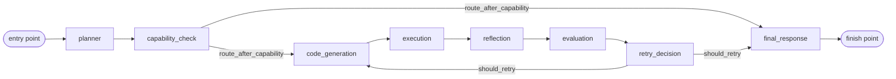

`execution`、`evaluation`、`reflection`、`retry_decision` 和 `final_response` 外面都套了
一层 `wrap_*_node` 发射器，`ExecutionEvent` 就是在这一层写出的 —— 节点函数本身对事件
完全无感知。

---

## 2. Governor 流水线

Governor 是重试 / 接受 / 停止的**唯一决策权威**。评估负责产出信号，分类负责解读信号，
策略阶段负责拍板。每个阶段都可以独立测试、独立替换。

`resolve()` 在**每一次**执行尝试之后都会运行，不只是失败的那些 —— `ACCEPT` 就是成功
路径。能力检查若判定拒绝，会在 `ClassifyStage` 和 `PolicyStage` 执行之前就从循环中返回：

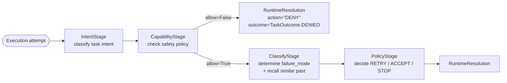

`RuntimeDecisionAction` 恰好只有三个成员 —— `RETRY`、`STOP`、`ACCEPT`。`"DENY"` 不在
其中：`RuntimeResolution.action` 的类型是 `str`，拒绝路径直接赋一个裸字符串。这个短路
本身依赖的是一条未被断言保护的约定 —— `engine.resolve()` 在**每个**阶段之后都会重新检查
`ctx.capability.allow`，而全局只有 `CapabilityStage` 会写这个字段。

| 阶段 | 模块 | 负责 |
|---|---|---|
| `IntentStage` | `governor/intent_stage.py` | `TaskIntent` 分类 |
| `CapabilityStage` | `governor/capability_stage.py` | 通过 `SemanticSafetyGuard` 产出 `CapabilityDecision` |
| `ClassifyStage` | `governor/classify_stage.py` | `failure_mode` + 记忆召回 + 重复模式告警 |
| `PolicyStage` | `governor/policy_stage.py` | 通过 `RetryPolicy` 产出 `PolicyOutcome`（action / outcome / outcome_reason） |

图节点 `retry_decision_node` 只是调用 `governor.resolve()` —— 业务逻辑住在 governor 里，
不在图里。

---

## 3. Skill 抽象

一个 Protocol 统一了两种调用范式：

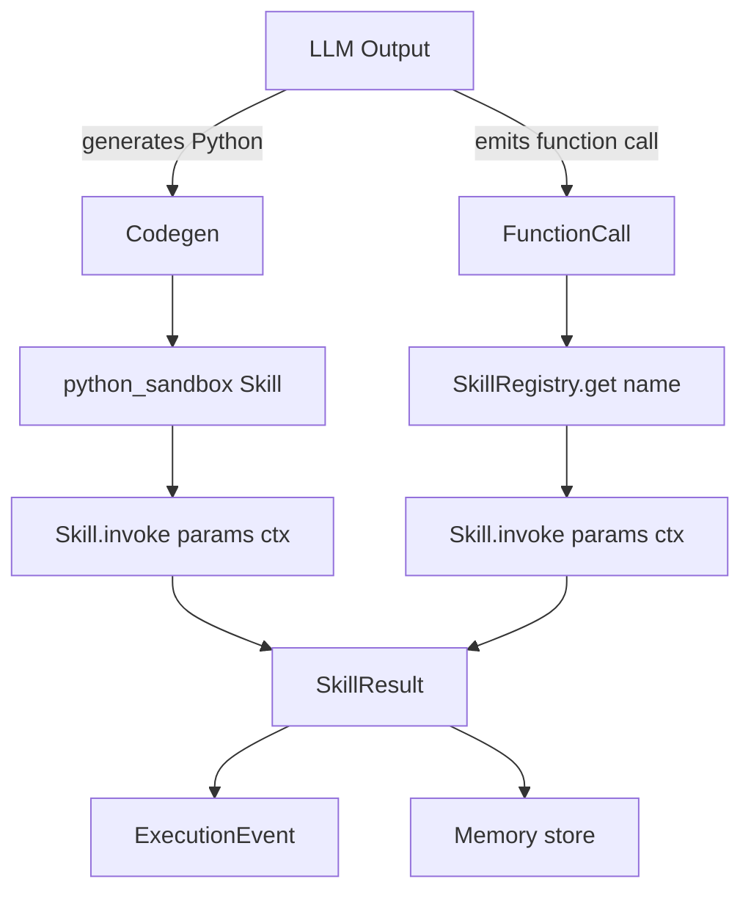

### 内置 skill

| Skill | 模块 | 用途 |
|---|---|---|
| `python_sandbox` | `skills/builtin/python_sandbox.py` | 以代码为行动，底层是可插拔的 `SandboxBackend` |
| `read` | `skills/builtin/read.py` | 带行号的文件读取，支持 offset/limit |
| `grep` | `skills/builtin/grep.py` | 纯 Python 正则搜索，3 种输出模式 |
| `glob` | `skills/builtin/glob_skill.py` | pathlib glob，按 mtime 排序 |
| `edit` | `skills/builtin/edit.py` | 严格唯一性的字符串替换 |
| `web_search` | `skills/builtin/web_search/` | 抽象掉 provider（默认 Tavily） |

所有文件类 skill 默认 `restrict_to_workspace=True` —— 除非显式关掉，否则它们无法读写
`SkillContext.workspace` 之外的任何路径。

### 沙箱后端（可插拔）

`PythonSandboxSkill` 自己并不执行代码 —— 它委托给一个 `SandboxBackend`。后端在
`SandboxExecutor` 构造时选定，因此同一个 skill 可以运行在两种隔离强度截然不同的环境里，
而调用方无需任何改动：

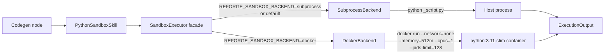

| 后端 | 启动开销 | 文件系统隔离 | 网络隔离 | CPU / 内存上限 | 适用场景 |
|---|---|---|---|---|---|
| `SubprocessBackend`（默认） | 仅一次进程启动 | **无** —— cwd 是工作区，宿主文件系统其余部分同样可达，且继承 runtime 的全部环境变量（含 API key） | 无 | 无 | 开发、CI、benchmark、我们愿意直接在宿主上运行的代码 |
| `DockerBackend`（按需开启） | ~1–3 s | 宿主文件系统被隔开，但 `/work` 以**可读写**方式挂载，且容器内以 **root** 运行 —— 见 KNOWN_LIMITATIONS L11 | `--network=none` | `--memory=512m --cpus=1 --pids-limit=128 --cap-drop=ALL --security-opt=no-new-privileges` | 演示、不可信代码、生产 |

这个 Protocol 刻意收得很窄 ——
`execute(code, *, workspace, timeout_s) -> ExecutionOutput` —— 因此接入第三种后端
（firecracker、gVisor、远程沙箱 API）不需要改动 facade。

### MCP 集成

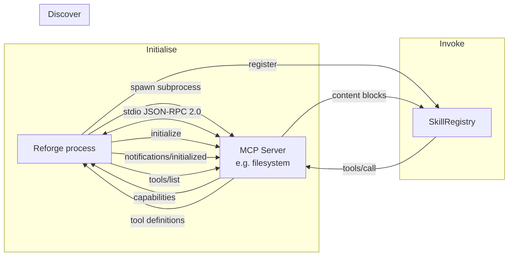

传输层（`runtime/mcp/client.py`）是手写的同步 JSON-RPC 2.0 客户端，跑在 stdio 上。不依赖
`mcp` SDK，也不会把 asyncio 传染进运行时。生命周期管理（`runtime/mcp/session.py`）负责
initialize 握手、`tools/list` 缓存、`tools/call` 派发，以及带强杀兜底的优雅关闭。

`MCPSkill` 把单个 MCP 工具适配成 `Skill` Protocol；注册名形如 `mcp.<server>.<tool>`，
这样多个 server 可以暴露同名工具而不冲突。

---

## 4. 事件溯源运行时

每一次生命周期状态转移都会发出一个不可变的 `ExecutionEvent`。事件日志只追加，通过
`PersistentEventLog` 行缓冲落盘，同时对外提供回放和实时订阅两种消费方式。

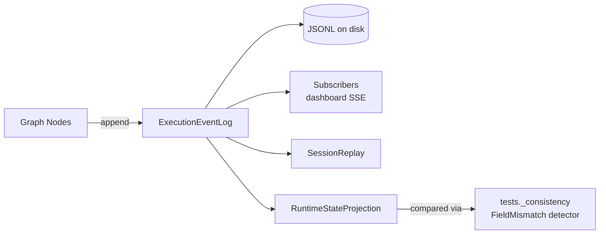

投影层（`runtime/events/projection.py`）**仅凭事件**就能重建出一份 `RuntimeState` 视图。
一致性校验器（`reforge/tests/_consistency.py`，属于测试基础设施，和调用它的契约测试放在
一起）用它来验证：节点侧的状态改写没有偏离事件所记录的内容。

这是长期迁移到事件溯源式 RuntimeState 的地基 —— 新状态一律进 `ExecutionEvent`，而不是
在（已冻结的）`RuntimeState` 上加字段。"RuntimeState 不得新增字段"这条规则由
`tests/test_state_no_flat_fields.py` 强制执行。

### 事件词表

| 类型 | 发出方 | 携带信息 |
|---|---|---|
| `EXECUTION_STARTED` | execution_node | 任务描述 |
| `EXECUTION_SUCCEEDED` | execution_node | 输出摘要 |
| `EXECUTION_FAILED` | execution_node | 类别、是否可恢复、错误、semantic_meaning |
| `RECOVERY_ATTEMPTED` | 发射器 wrap | 策略、第几次尝试 |
| `EVALUATION_COMPLETED` | evaluation_node | 分数、是否通过、理由 |
| `REFLECTION_GENERATED` | reflection_node | 摘要 |
| `POLICY_DECIDED` | retry_decision 发射器 | 决策、理由 |
| `TASK_COMPLETED` | final_response_node | 结局、理由、答案摘要 |

---

## 5. 记忆基座

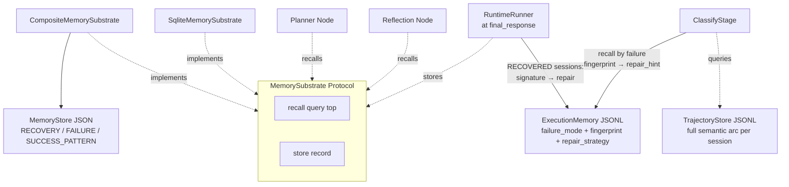

`MemorySubstrate` 是一个 Protocol —— 任何满足 `recall()` / `store()` 的对象都可以通过
`build_graph(memory_substrate=...)` 或 `RuntimeRunner(memory_substrate=...)` 注入进来。
`ExecutionMemory` 和 `TrajectoryStore` 被刻意放在 Protocol 之外：governor 的修复召回是按
**结构化失败指纹**做键的（而非自由文本查询），所以它有一条自己的、更窄的读写路径。

### 为什么是三层，而不是一个向量库

- `ExecutionMemory` 是失败→修复的快路径查表：会话以 RECOVERED 结束时写入，由
  `ClassifyStage` 用当前失败的指纹召回，最终作为重试的 `repair_hint` 送到代码生成端；
- `MemoryStore` 是带分类的类型化长期存储；
- `TrajectoryStore` 保存完整的会话弧线，用于跨会话的相似度比对。

用单一向量库会把运行时本来需要区分开的信号糅在一起。基座 Protocol 已经留好了口子，
Qdrant 之类的后端可以在不改调用方的前提下接进来 —— 但类型化的分层要先立住。

---

## 6. 多智能体层

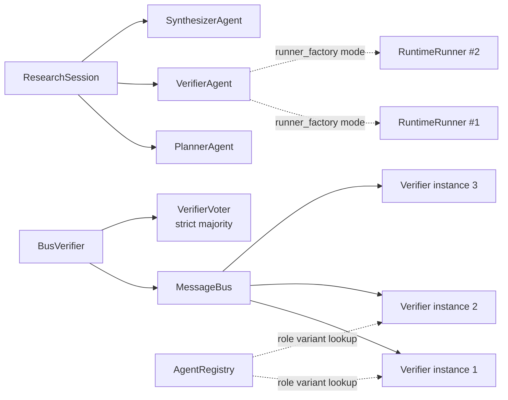

`PlannerAgent`、`VerifierAgent`、`SynthesizerAgent` 都是 `@runtime_checkable` 的 Protocol。
默认实现 `RunnerVerifier` 同时支持共享 runner 和逐次调用工厂两种模式 —— 后者为每次校验
新建一个 `RuntimeRunner`，用于并行研究编排中的 worker 隔离。

`BusVerifier` 通过 `MessageBus` 把一个假设扇出给 N 个校验者，再用 `VerifierVoter`
（严格多数，> 50%）汇总共识。当 N 个校验者出现 2 比 2 的僵局时，结论是 `inconclusive`。

### Agent 能力（运行时级隔离）

Agent 不再只是提示词层面的角色 —— 每个 agent 都携带一个类型化的 `AgentCapability`
信封，由 SkillRegistry 在边界处校验。

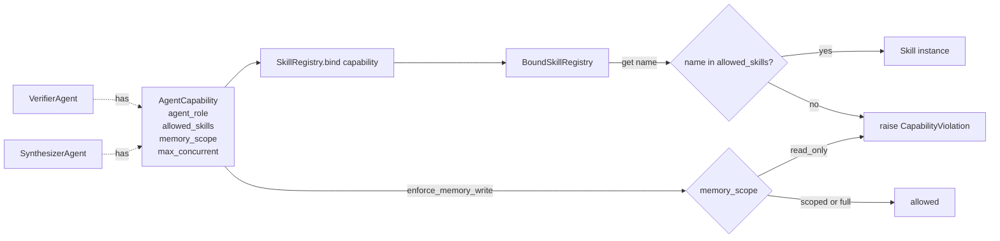

| 开关 | 类型 | 效果 |
|---|---|---|
| `allowed_skills` | `frozenset[str] \| None` | `None` 表示不限制；否则注册表会拦截查找。 |
| `memory_scope` | `read_only` / `scoped` / `full` | `read_only` 会在基座包装层阻断写入。 |
| `max_concurrent` | `int >= 1` | 给并行编排的提示值。 |

强制点落在边界上（`SkillRegistry.get` / `bind`），绝不放进 agent 内部 —— 放进去就违背了
声明式能力的初衷。

---

## 7. 可观测性仪表盘

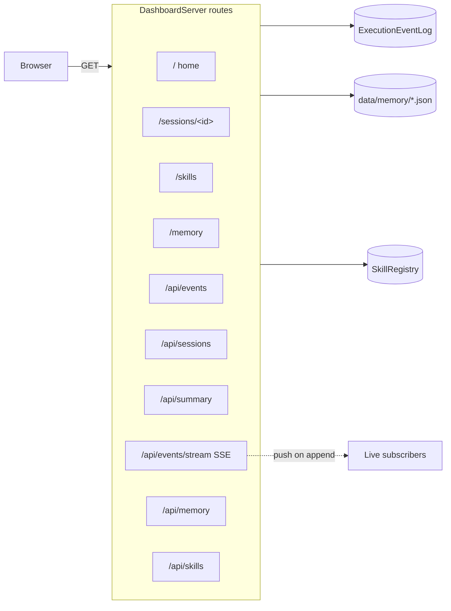

实现上只用标准库 `http.server`。前端是 CDN 引入的 Tailwind + Alpine.js + Chart.js，
内联进 `pages.py` —— 不发布静态文件，也没有构建步骤。无论事件日志正在被实时写入，
还是从磁盘加载的历史文件，仪表盘都能正常工作。

---

## 8. EDA 应用（实例演练）

这是构建在运行时之上的第一个非合成应用 —— 用来演示一个领域工作流如何在不改动核心层的
前提下接进来。

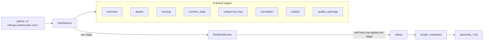

设计特性：

- **每个阶段 = 一次 `RuntimeRunner.run()`** —— 每个阶段拿到自己的 session_id 和完整的
  governor / 反思 / 重试循环，所以第 3 阶段遇到的畸形列不会污染第 4 阶段。
- **记忆基座在各阶段之间共享** —— 运行时能在同一个数据集的一轮运行内学到"这个数据集的
  dtype 很怪"这类模式。
- **不需要新增任何运行时钩子** —— EdaSession 属于应用层代码，它消费 RuntimeState 的方式
  和 benchmark runner 完全一样。
- **Markdown 报告生成是确定性的** —— 给定一份 `EdaReport`，版式是固定的（总览 / 逐阶段
  表格 / 逐阶段细节 / 自愈足迹页脚），因此不同数据集报告之间的 diff 纯粹是数据内容差异。

已通过 `scripts/prepare_eda_datasets.py` 在 3 个真实数据集上验证
（iris / titanic / wine_quality）—— 每个数据集实际留下的自愈足迹见 `docs/eda_*.md`。

---

## 9. Text-to-SQL benchmark（实例演练）

运行时之上的第二个应用 —— 架构形态和 EDA 一致，但针对"对着标准答案做 benchmark 式度量"
做了优化。

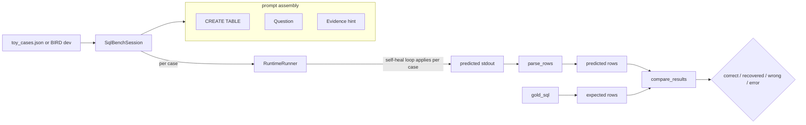

设计特性：

- **以结果为准**：状态由 `compare_results` 判定，而不是由 `task_outcome` 判定。一个
  `FAILED` 结局、但最终 stdout 恰好与标准答案一致的用例会被判为 `recovered` 而非
  `error` —— 报告要如实反映模型究竟产出了什么。
- **遵循 BIRD/Spider 的 exec_acc 语义**：顺序无关的多重集比较（除非该问题带 `ORDER BY`
  且标记了 `expects_ordering=True`）、int/float 漂移的数值容差、NULL 与空白的规范化。
- **和其他部分一样可插拔**：`SqlBenchSession` 接受 `runner_factory` 以支持基于 mock 的
  单元测试，与 `BenchmarkRunner`、`EdaSession` 完全一致。
- **可复用的提示词边界**：`build_prompt(case)` 把 LLM 约束在"单条 SQL → 每行一条记录、
  用 ` | ` 分隔"上 —— 既让解析器保持确定性，也让比较器与自然语言的输出格式解耦。

演练用的数据在 `data/sql_bench/toy_cases.json`（一个 4 表学籍库上的 15 个问题）。
BIRD-SQL dev 集需要通过 `scripts/prepare_bird.py` + `bird_loader.py` 显式接入。

---

## 10. 子系统边界

`OWNERSHIP.md` 里的归属表由契约测试强制执行：

| 文件 | 冻结了什么 |
|---|---|
| `tests/test_workflow_module_slim.py` | `graph/workflow.py` 的行数预算；每个节点文件 ≤ 100 行 |
| `tests/test_state_no_flat_fields.py` | RuntimeState 上不得出现扁平字段 |
| `tests/test_substrate_injection.py` | MemorySubstrate 可通过 `build_graph(memory_substrate=...)` 注入 |

这些测试每次跑测试都会执行，因此任何偏离架构的漂移都会被立即抓住，而不是等债务堆积
之后才暴露。

---

## 11. 延伸阅读

- 审计历史与历史决策：`docs/EVOLUTION.md`
- 各子系统的职责归属：`OWNERSHIP.md`
